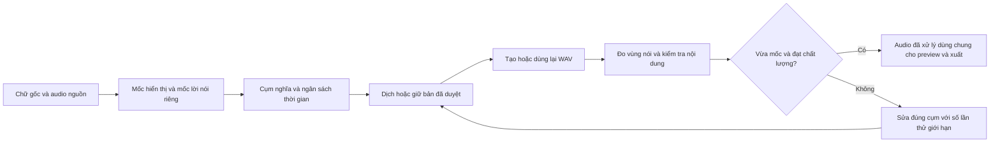

# Đồng bộ video gốc, phụ đề và giọng lồng tiếng

Phương án phù hợp nhất là giữ nguyên hình ảnh, xác định các mốc lời nói từ nguồn, rồi tạo và kiểm tra giọng dịch theo từng cụm nghĩa trong các mốc đó. Cần quản lý riêng thời gian hiển thị phụ đề, thời gian lời nói gốc và thời gian lời nói mới. Việc kéo mọi WAV cho vừa ô phụ đề hoặc đẩy đoạn sau để tránh chồng không bảo đảm đồng bộ nội dung.

Báo cáo áp dụng cho Content Bot trên Windows, Intel i5-13420H và RTX 4050 Laptop 6 GB, với VieNeu v3 Turbo SDK 3.6.4 đang cài. Phạm vi giữ nguyên video gốc; không sửa khuôn mặt, không yêu cầu khai báo tên hay quan hệ nhân vật. Nguồn và mã được đối chiếu ngày 13-09-2026. Các ngưỡng và kiến trúc bên dưới là đề xuất kỹ thuật, chưa phải tính năng đã triển khai hoặc độ chính xác đã đo.

## Kết luận kỹ thuật

Kế hoạch triển khai theo giai đoạn, hợp đồng dữ liệu và tiêu chí bàn giao nằm trong [DUBBING_SYNC_IMPLEMENTATION_PLAN.md](DUBBING_SYNC_IMPLEMENTATION_PLAN.md).

Có thể bảo đảm một số thuộc tính bằng phần mềm: đặt audio vào timeline đã định, không tạo trôi thời gian dây chuyền, không cắt mất phần đã nhận diện là lời nói, và dùng cùng audio đã xử lý cho chế độ nghe kiểm tra/xuất. Xem trước nhanh bằng trình duyệt là chế độ gần đúng riêng. Không thể từ đó suy ra mốc ban đầu đúng với video, bản dịch đủ nghĩa hay phát âm tự nhiên.

Nghiên cứu về automatic dubbing kết hợp kiểm soát độ dài bản dịch, căn nhịp lời/nghỉ và điều chỉnh thời lượng TTS. Đây là bài toán nhiều tầng, không chỉ là đồng bộ file. Kiến trúc IWSLT 2020 và nghiên cứu tối ưu đồng thời bản dịch–thời lượng là cơ sở cho hướng này, nhưng kết quả của chúng không chứng minh mức cải thiện trên tiếng Trung–Việt hoặc VieNeu của dự án. [1](https://aclanthology.org/2020.iwslt-1.31/), [2](https://arxiv.org/abs/2302.12979).

Nghiên cứu TACL 2023 trên 319,57 giờ từ 54 tựa phim/chương trình chuyên nghiệp cho thấy độ tự nhiên và chất lượng dịch cần được cân nhắc cùng các ràng buộc thời gian; số ký tự tương đương không phải mục tiêu đủ để tạo bản lồng tiếng tốt. Vì vậy, không nên dùng tiêu chí “mọi câu vừa khung” để che việc tăng tốc quá mạnh hoặc lược mất nghĩa. [3](https://aclanthology.org/2023.tacl-1.25/).

**Thứ tự đề xuất:** sửa kiểm tra timeline và ngăn dồn mốc → phân biệt mốc chữ/lời nói → xử lý khoảng lặng và nhịp vừa phải → tạo lại có giới hạn các câu không vừa → chỉ bổ sung căn từng từ cho vùng cần thiết. Giữ VieNeu hiện tại trong giai đoạn đầu, tránh thay engine trước khi sửa sai sót ở tầng ứng dụng.

## Bằng chứng từ dự án hiện tại

Ảnh chụp dữ liệu dùng cho phân tích là voice document revision 540, gồm 1.000 đoạn; 626 đoạn có asset và thời lượng audio. Dấu thời gian, hash tài liệu và cách thống kê được lưu trong [audit.json](../artifacts/voiceover/sync-research/audit.json); danh sách từng đoạn nằm trong [timing-audit.csv](../artifacts/voiceover/sync-research/timing-audit.csv). Chưa nghe/đối chiếu toàn bộ các đoạn này với video, nên các con số sau là bất nhất với timeline phụ đề được lưu, không phải tỷ lệ sai với nguồn thật.

| Chỉ số tại thời điểm đọc | Số lượng | Diễn giải |
|---|---:|---|
| Có audio để kiểm tra | 626 | Không tính 374 đoạn chưa có audio |
| Có offset khác 0, toàn tài liệu | 595 | Bao gồm 197 đoạn chưa có audio |
| Có offset khác 0 trong nhóm có audio | 398 | Offset không mặc nhiên là lỗi; có thể là chỉnh tay hợp lệ |
| Audio sau chia tốc độ vẫn dài hơn ô phụ đề | 278 | Dùng dung sai số học 2 ms của ứng dụng |
| Kết thúc audio sau khi cộng offset vượt cuối ô | 425 | Bao gồm lỗi do thời lượng hoặc do dịch vị trí |
| Đang “ready” nhưng kết thúc vượt cuối ô | 147 | Trạng thái hiện tại chưa kiểm tra đầy đủ vị trí tuyệt đối |
| Khoảng audio chồng với ít nhất một khoảng trước đó | 209 | Đếm bằng quét mốc kết thúc xa nhất, không chỉ cặp liền kề |
| Tốc độ trên 1,2× / trên 1,5× | 51 / 25 | Trong 626 đoạn có audio |
| Độ dịch tuyệt đối lớn nhất | 4.900 ms | Chưa chứng minh đây là sai lệch với lời nói nguồn |

Ví dụ quanh 01:24:

| Thuộc tính | Giá trị |
|---|---|
| Lời đọc | “Con mới không thèm ở cái chỗ rách này đâu!” |
| Ô phụ đề | 84.500–85.800 ms, dài 1.300 ms |
| WAV gốc | 2.400 ms |
| Tốc độ đang đặt | 1,85× |
| Offset | +157 ms |
| Điểm bắt đầu phát | 84.657 ms |
| Điểm kết thúc suy ra | 85.954,3 ms |
| Vượt cuối ô | 154,3 ms, dù trạng thái là “ready” |

Chỉ kiểm tra `duration / rate <= end - start` sẽ cho trường hợp này qua. Kiểm tra vị trí phải tính cả `start + offset + duration / rate`. Sau các bước xử lý audio, cần thay thời lượng suy ra bằng thời lượng đầu ra thực đo.

Các điểm mã liên quan:

- [planner.ts](../frontend/src/voiceover/planner.ts): tạo một đoạn giọng từ mỗi cue, lấy `start_ms/end_ms` của chữ, mặc định rate 1,08; chưa dùng `speech_start_ms/speech_end_ms` làm mốc giọng. Auto-fit có thể tăng tới 2×. Ripple đẩy câu sau để tránh chồng.
- [store.py](../backend/app/services/voiceover/store.py): tự fit tối đa 1,20× khi gắn asset; trạng thái dựa vào độ dài khung, chưa bao gồm độ dịch vị trí.
- [mix.py](../backend/app/services/voiceover/mix.py): kiểm tra audio chồng, vượt video và quá dài; vẫn thiếu kiểm tra đầy đủ việc audio bị dời khỏi khung nguồn tương ứng. Xuất dùng FFmpeg `atempo`.
- [playbackIndex.ts](../frontend/src/voiceover/playbackIndex.ts): khi chồng, đoạn bắt đầu sau được chọn; phần trước không được tiếp tục sau đó. Điều này có thể nghe như bị mất cuối câu.
- [playbackEngine.ts](../frontend/src/voiceover/playbackEngine.ts): lấy video làm đồng hồ là nền tảng đúng; audio dùng `HTMLAudioElement.playbackRate`, sửa lệch khi vượt 80 ms. Ngưỡng này không phải cam kết độ chính xác đầu ra.

Không nên xóa tất cả offset của dự án đang có: chưa có dữ liệu phân biệt chỉnh tay với dịch tự động. Cần tạo phiên bản phục hồi, đánh dấu đoạn cần kiểm chứng và sửa theo mốc nguồn đã xác nhận.

## Ba loại thời gian phải tách riêng

**Thời gian chữ xuất hiện** trả lời “bản dịch này hiển thị khi nào?”. Nếu có phụ đề gốc, nội dung và mốc hiển thị của nó tiếp tục được giữ làm bằng chứng chính cho lớp phụ đề. Một cue có thể là vế ở dấu phẩy, không cần câu hoàn chỉnh.

**Thời gian lời nói nguồn** trả lời “phần nội dung tương ứng được nói khi nào?”. Chữ có thể hiện trước hoặc lưu lâu hơn tiếng. Mốc của chữ và tiếng khác nhau hợp lệ; cố ép hai lớp giống tuyệt đối có thể làm giọng sai nhịp. Khi chữ trên màn hình khác lời nói, cần ghi xung đột thay vì lặng lẽ thay bản dịch chữ bằng bản chép ASR.

**Thời gian lời nói mới** gồm thời gian file và vùng âm thực sự có lời. Ví dụ WAV có 120 ms im lặng ở đầu thì đặt file đúng mốc không có nghĩa âm đầu đúng mốc. Phải biết khoảng đầu/cuối còn im, các khoảng nghỉ bên trong và thời lượng sau hiệu chỉnh.

Một mô hình dữ liệu phù hợp có `display_interval`, `source_speech_interval`, `target_speech_intervals`, `alignment_method`, độ tin cậy và xuất xứ mốc. Các mốc chưa đo giữ trạng thái chưa xác minh. `timing_precision_ms=10` chỉ nói lưới lưu 10 ms; không được hiểu là sai số thực nhỏ hơn 10 ms.

Tài liệu phụ đề hiện có trường `speech_start_ms/speech_end_ms`, nhưng cần kiểm tra độ phủ và chất lượng của từng trường trước khi ưu tiên dùng. Không mặc định mọi cue đều có mốc lời nói đáng tin.

## Căn lời nói nguồn và giọng mới

| Phương pháp | Làm được | Giới hạn và cách áp dụng |
|---|---|---|
| Mốc chữ/OCR | Khoanh thời gian phụ đề gốc xuất hiện, bảo toàn nội dung | Không chứng minh đó là âm đầu/âm cuối; chữ trong im lặng không tự động trở thành lời lồng tiếng |
| VAD | Xác định vùng có/không có tiếng nói | Không biết nội dung, người nói hoặc từ nào; dùng làm biên thô và cảnh báo |
| ASR có timestamp | Nhận dạng lời và ước lượng mốc từ | Có thể sai lời, số, tên riêng hoặc chồng tiếng; không tự thay nguồn chữ |
| Forced alignment | Căn transcript đã biết vào audio cùng ngôn ngữ | Không dịch; có thể ép transcript sai vào audio và tạo kết quả trông hợp lệ |
| Phân bổ theo số chữ | Tạo mốc xấp xỉ khi thiếu bằng chứng | Không gọi là mốc từ đã đo, không dùng để cắt waveform ở giữa lời |

Silero VAD có triển khai ONNX và phù hợp để tạo một lớp kiểm tra vùng nói; dự án đã có model và cache VAD. Tuy nhiên, cache phục vụ chia chunk trước đây không tự có độ phân giải/ngữ nghĩa đủ để chứng nhận mọi ranh giới câu. [4](https://github.com/snakers4/silero-vad).

WhisperX có bước forced alignment riêng với model theo ngôn ngữ. Mã hiện tại liệt kê model tiếng Việt `nguyenvulebinh/wav2vec2-base-vi-vlsp2020` và model tiếng Trung. Có thể căn lời gốc với audio gốc bằng model nguồn, rồi căn bản dịch với WAV mới bằng model Việt; không căn trực tiếp văn bản Việt vào lời nói Trung. Tài liệu cũng nêu hạn chế với ký tự ngoài từ điển và chồng tiếng. Đây là ứng viên thử ở các cửa sổ ngắn, chưa phải bảo đảm chất lượng hoặc VRAM phù hợp khi chạy cùng TTS. [5](https://raw.githubusercontent.com/m-bain/whisperX/main/whisperx/alignment.py), [6](https://github.com/m-bain/whisperX#limitations-).

Trong [subtitle_alignment.py](../backend/app/services/subtitle_alignment.py), nhánh `energy` phân bổ mốc từ theo độ dài token; nhánh `faster_whisper` nhận timestamp ASR rồi ghép/nội suy. Cả hai có thể gắn nhãn `forced_alignment`, nên nhãn hiện tại chưa phân biệt phép đo âm học với ước lượng. Nhánh energy đang bỏ qua cue screen/mixed để tránh ghi đè sai nguồn; cần giữ nguyên nguyên tắc thận trọng này.

Đề xuất đánh dấu phương pháp ở từng mốc: `screen_observed`, `asr_observed`, `ctc_aligned`, `energy_estimated`, `interpolated`, `manual`. Giữ score gốc nhưng không gọi score là xác suất chính xác nếu chưa hiệu chuẩn. Khi coverage transcript thấp hoặc biên rơi vào vùng không chắc chắn, không cắt tiếng hay di chuyển phụ đề tự động.

## Đơn vị cần căn là cụm nghĩa, không phải từng từ dịch tương ứng

Thứ tự từ và số âm tiết thay đổi giữa các ngôn ngữ. Cần ánh xạ một hoặc nhiều phần văn bản nguồn sang một cụm nghĩa tiếng Việt, rồi gắn cụm với vùng nói nguồn. Một câu có hai vế và một khoảng nghỉ rõ cần giữ hai nhịp đó; chia đều thời gian cho từng từ sẽ làm sai nhấn/ngắt.

Nghiên cứu IWSLT 2023 dùng nhiều bản dịch có độ dài khác nhau, dự đoán thời lượng âm vị rồi xếp hạng/điều chỉnh. Bài học áp dụng ở đây là lựa chọn bản dịch dựa trên thời lượng nói dự kiến, không dựa riêng số ký tự. Mô hình và ngôn ngữ trong nghiên cứu khác dự án nên không chuyển các con số benchmark sang tiếng Việt. [7](https://aclanthology.org/2023.iwslt-1.9/).

Nghiên cứu VideoDubber cũng đưa thời lượng tiếng nói vào kiểm soát độ dài khi dịch. Phương án nhẹ cho ứng dụng là ước lượng từ audio VieNeu đã có theo từng giọng, rồi đo thật bản được chọn; không cần huấn luyện lại model ngay. [8](https://arxiv.org/abs/2211.16934).

Giữ một WAV cho mỗi cue là lựa chọn mặc định hiện tại. Với nhiều cue ngắn thuộc cùng một lượt nói liên tục, thử sinh chung cụm để giữ nhịp rồi căn tiếng Việt vào WAV. Có thể giữ một WAV cho cả cụm, mapping tới nhiều cue chữ; chỉ chia file khi cần và có ranh giới âm học đáng tin. Không ghép các lượt đối đáp của người khác nhau hoặc chia waveform theo số chữ. Batch TTS nhiều câu độc lập chỉ tăng thông lượng, không tự tạo ngữ điệu liên tục.

### Câu ngắn và audio thiếu thời lượng

Phân biệt ba trường hợp: câu ngắn tự nhiên như “Hả?”; audio thiếu/lặp từ do lỗi sinh; và nhiều vế cùng lượt nói bị vụn do sinh riêng. WAV ngắn hơn ô không tự động là lỗi: giữ khoảng nghỉ hợp lệ, không kéo chậm hay thêm lời để lấp đầy. Với nghi vấn nuốt âm, nghe kiểm tra hoặc ASR chọn lọc trước khi tạo lại. Với giọng vụn, đưa thử nghiệm sinh cụm vào tập đánh giá sớm, nhưng chỉ tự động áp dụng sau khi xác minh mapping và biên nói.

Độ lớn không đều cần đo riêng với lỗi thời lượng. Không khuếch đại từng tiếng ngắn chỉ để mọi đoạn có cùng độ lớn: có thể phá khác biệt thì thầm/la hét; dùng ngữ cảnh lượt nói và kiểm tra clipping. Chưa có phép nghe/đo trong audit chứng minh VieNeu luôn nuốt âm hoặc gắt ở các câu 0,4–0,6 s.

Không cần suy luận tên hoặc quan hệ nhân vật để làm việc này. Có thể dùng mã vùng nói ẩn danh khi cần tránh trộn hai lượt thoại. Chồng lời thật phải được đánh dấu riêng; pipeline preview hiện chỉ chọn một đoạn đang phát nên chưa phù hợp để tự xử lý mọi chồng lời thành bản lồng tiếng đồng thời.

## Bộ lập lịch có giới hạn thay cho dồn đoạn dây chuyền

Cho cụm i có mốc nói nguồn `[a_i, b_i]`, vùng phát hợp lệ `[L_i, U_i]`, độ dài audio sau xử lý khoảng lặng `D_i`, tốc độ `r_i`, điểm bắt đầu `s_i`. Trước khi tạo audio đã xử lý, có thể dùng ước lượng `e_i = s_i + D_i / r_i`. Sau xử lý phải dùng độ dài waveform thực đo để xác nhận.

Các ràng buộc đề xuất:

- `s_i >= L_i`, `e_i <= U_i`; giữ mốc nguồn cố định trừ khi có bằng chứng sửa nó.
- Với các lượt nói nối tiếp: `e_i <= s_(i+1)`; chỉ chừa khoảng nghỉ khi nguồn hoặc quy tắc biên đã xác minh yêu cầu, không tự cộng 60 ms sau mọi cue.
- Không dịch mốc một cụm để bù thiếu thời gian của cụm trước; bài toán của mỗi cụm kết thúc trong vùng nguồn tương ứng.
- Nội dung, phủ đủ lời, không cắt âm, và không ghi đè chỉnh tay là điều kiện trước khi tối ưu độ gần mốc.

Vùng hợp lệ không chỉ là ô chữ. Có thể bao gồm chút khoảng im lặng liền kề nếu bằng chứng cho phép, nhưng không chiếm lời khác hoặc sự kiện cần giữ. Cắt cảnh là một dấu hiệu cần kiểm tra, không tự động là biên cứng: lời thoại có thể tiếp tục qua cảnh cắt.

Đây là **mượn khoảng lặng có giới hạn**, khác thao tác ripple hiện đẩy mốc câu sau. Có thể thử trần 200–300 ms, nhưng lượng mượn thực tế là phần nhỏ hơn giữa trần, khoảng trống đã xác minh sau khi giữ biên bảo vệ, và giới hạn ngữ cảnh. Ví dụ câu kết thúc nguồn ở 5,0 s, lượt kế bắt đầu 5,5 s: nếu đã xác minh khoảng nghỉ cho phép, audio mới có thể kết thúc 5,2 s và lượt kế vẫn bắt đầu 5,5 s. Không mặc định mọi câu đều có 0,5–1,2 s để mượn; một khoảng không có chữ chưa chứng minh không có lời. Giữ nguyên cả thời gian hiển thị chữ nếu không có bằng chứng cần sửa.

Trong các phương án thỏa điều kiện, ưu tiên sai số âm đầu/âm cuối nhỏ, tốc độ gần 1× và giữ các khoảng nghỉ chính. Có thể đặt ngân sách thử ban đầu 0,95–1,15×, chuyển 1,15–1,20× sang kiểm tra chất lượng chặt hơn. Đây là lựa chọn để đánh giá, không phải ngưỡng phổ quát chứng minh giọng luôn tốt. Không tự kéo chậm câu ngắn cho phủ kín ô nếu nguồn có khoảng nghỉ hợp lệ.

Nếu không có nghiệm giữ đủ nghĩa và chất lượng trong vùng được phép, hệ thống phải báo lý do cụ thể và giữ bản trước; không trả “đã khớp” chỉ vì cắt waveform hoặc đẩy câu sau. Với ví dụ 2,4 s trong 1,3 s, muốn chỉ dùng tốc độ tối đa 1,15× thì bản audio hữu ích cần dài không quá khoảng 1,495 s. Chưa đo im lặng nên chưa biết phần nào của chênh lệch có thể xử lý mà không đổi lời.

## Vòng sửa tự động có giới hạn

Lần đầu ưu tiên dùng WAV có sẵn. Chỉ cắt im lặng đầu/cuối khi đủ chắc và còn biên bảo vệ phụ âm nhỏ, hơi thở phù hợp; không xóa mọi khoảng lặng nội bộ. Sau đó thử điều chỉnh nhịp nhẹ. Các bước này không cần Gemini hay TTS mới.

Trim là bước đo/sửa rẻ, không phải cách cứu mọi câu quá dài. Phải đo biên trên WAV cụ thể; audit hiện chỉ có tổng thời lượng, chưa xác nhận giả thuyết VieNeu luôn có 50–120 ms đệm. Với ví dụ 2,4 s trong 1,3 s, ngay cả giả sử bỏ được 120 ms tổng cộng thì vẫn cần khoảng 1,75× nếu không nới vùng nói. Không cắt thêm lời để đạt trần tốc độ.

Nếu lỗi nằm ở bản sinh — lặp, thiếu, khoảng dừng bất thường — thử lại riêng cụm một lần. Nếu lời dịch quá dài về bản chất, Gemini đề xuất tối đa hai bản diễn đạt ngắn hơn, giữ thông tin, phủ định, số, tên riêng và sắc thái. Giới hạn ban đầu là hai lần TTS bổ sung mỗi cụm, dừng sớm khi đạt. Đây là ngân sách đề xuất nhằm tránh vòng lặp làm tải máy tăng không kiểm soát.

Thêm ngân sách toàn job cho số ứng viên TTS, số request Gemini và thời gian sửa; checkpoint phải giữ cả ngân sách đã tiêu, tránh khởi động lại làm lặp vô hạn. Chọn mức mặc định sau pilot, không suy từ 278/626 đoạn vượt ô rằng tất cả đều cần viết lại. Sau khi sửa mốc, đo khoảng lặng và thử tempo, chỉ gửi các cụm còn không vừa; gom nhiều cụm độc lập trong một request có ID/mapping riêng để giảm số request, không gộp nội dung giữa các lượt thoại. Ước lượng thời lượng theo dữ liệu giọng hiện có để loại ứng viên rõ ràng không khả thi trước TTS, rồi đo thật ứng viên còn lại. Ước lượng vẫn có sai số và không được tự loại bản đầy đủ nghĩa chỉ vì dài.

Không dùng một tốc độ cố định “tiếng Việt 3–4 âm tiết/s” làm định luật; phải xét giọng, cảm xúc, khoảng nghỉ và WAV thực tế. “Con không ở đây!” không phải bản thay thế đạt yêu cầu cho “Con mới không thèm ở cái chỗ rách này đâu!” vì thay đổi sắc thái và ý. Không phải câu nào cũng tồn tại bản rút gọn tốt. Khi hết ngân sách hoặc không giữ được nghĩa, lưu bản trước và trạng thái chưa giải quyết. Chưa có phép đo cho kết luận vòng sửa sẽ tốn thêm 30–45 phút trên video hai giờ.

Gemini nên nhận ngữ cảnh lân cận để hiểu nghĩa, nhưng vùng được sửa là danh sách cụm rõ ràng. Đầu vào gồm `source_text`, `translated_text`, các khoảng nói/nghỉ đã đo, thời lượng audio vừa tạo, thông số tốc độ cho phép và mã lỗi. Đầu ra là bản văn ứng viên, mapping tới cue và cờ thiếu bằng chứng; không cần trường phân tích suy nghĩ. Timestamp khóa do bộ lập lịch quản lý, không để model tùy ý nới để “đạt”.

Không tự rút gọn cue chỉnh tay hoặc lời đọc tùy biến. **Tách bản dịch hiển thị và lời đọc; mặc định không ghi đè phụ đề khi sửa lời đọc.** Dự án đã có `cue.text`, `clip.source_text` và `clip.spoken_text`; `syncVoiceCues` giữ lời đọc tùy biến khi nó khác bản văn nguồn lưu trong clip. Vì vậy, cần làm rõ hợp đồng và mapping/phiên bản, không thêm trường `display_text` trùng chức năng chỉ để đổi tên. Trong voice clip, `source_text` là bản chữ đầu vào TTS, không mặc nhiên là transcript ngôn ngữ gốc. Hai bản có thể khác cách diễn đạt nhưng không được mâu thuẫn, mất ý hoặc sắc thái thiết yếu. Giữ nguyên tắc cue một câu/vế, có thể tách ở dấu phẩy và bám phụ đề gốc.

Nếu sau này có chế độ “phụ đề theo lời lồng tiếng”, tạo track riêng theo lời đọc đã chọn và liên kết phiên bản, không âm thầm thay bản dịch từ nguồn. Phân biệt này cũng cần khi viện dẫn thực hành chuyên nghiệp: Netflix yêu cầu SDH tiếng Việt dựa trên audio/kịch bản lồng tiếng trong giới hạn đọc và thời gian; không có quy tắc mọi phụ đề luôn phải khác lời đọc. Phụ đề dịch cũng chịu giới hạn tốc độ đọc. [15](https://partnerhelp.netflixstudios.com/hc/en-us/articles/220447048-Vietnamese-Timed-Text-Style-Guide). Hướng dẫn dubbing của Netflix ưu tiên ý định gốc khi cân nhắc đánh đổi đồng bộ môi; đây là căn cứ bảo vệ sắc thái, không phải phép bỏ nghĩa để vừa ô. [16](https://partnerhelp.netflixstudios.com/hc/en-us/articles/10258693072403-Dubbing-Creative-Guidelines-Films-Series).

## Xử lý audio và thống nhất preview/xuất

FFmpeg trên máy có `atempo`, `rubberband`, `silencedetect`, `silenceremove`; đã kiểm tra danh sách filter mà không chạy xử lý video. `atempo` chỉnh tempo; `rubberband` cung cấp time-stretch và pitch-shift khi build có thư viện tương ứng. Có thể so sánh hai bộ lọc trên mẫu giọng nhỏ, không mặc định Rubber Band luôn tốt hơn. Cắt im lặng phải phân biệt biên ngoài với khoảng nghỉ mang nghĩa. [9](https://ffmpeg.org/ffmpeg-filters.html#atempo), [10](https://ffmpeg.org/ffmpeg-filters.html#rubberband), [11](https://ffmpeg.org/ffmpeg-filters.html#silenceremove).

Preview hiện giữ cao độ bằng `preservesPitch`, nhưng đây chỉ là yêu cầu cho trình duyệt khi đổi playback rate, không bảo đảm cùng thuật toán hoặc waveform với FFmpeg. Giữ chế độ này để xem trước nhanh; không xem nó là bằng chứng âm thanh xuất giống hệt. Chế độ nghe kiểm tra dùng asset tempo/trim **tạo theo nhu cầu** cho vùng đang nghe; export tái sử dụng đúng asset hợp lệ hoặc xử lý phần còn thiếu cùng cấu hình. Phát asset đã xử lý ở tốc độ đoạn 1× để tránh nhân tempo hai lần. Không cần dựng trước toàn bộ 1.500 WAV mới cho mỗi lần chỉnh sửa. Tốc độ video toàn cục vẫn là biến đổi riêng nếu có chỉnh dựng. [12](https://developer.mozilla.org/en-US/docs/Web/API/HTMLMediaElement/preservesPitch).

Rubber Band lưu ý bù đệm/độ trễ ở chế độ thời gian thực. Nếu tích hợp trực tiếp thư viện, phải xử lý độ trễ đúng theo chế độ; với FFmpeg cũng cần đo file kết quả thay vì giả định công thức chia thời lượng là chính xác tới mẫu. [13](https://breakfastquay.com/rubberband/integration.html).

Asset xử lý nên có cache key riêng gồm checksum WAV gốc, biên trim, tempo, bộ lọc và phiên bản. Mốc đặt trên timeline không cần làm sinh lại WAV gốc. Chuẩn hóa PTS video/audio về cùng gốc; khi cắt/chỉnh tốc độ, dùng chung time map cho chữ và tiếng, chỉ biến đổi một lần. Không coi độ chính xác lưới 10 ms hay FPS proxy là độ chính xác bằng chứng nguồn.

Gộp các thay đổi liên tiếp trước khi render, hủy tác vụ cũ chưa cần, giới hạn worker và dung lượng cache; loại cache ít dùng nhưng giữ WAV gốc. Nếu gain/fade được bake vào asset, cache key phải chứa chúng. Job xuất khóa phiên bản đầu vào và giữ các asset đang sử dụng để chỉnh sửa/cache eviction không làm sai bản xuất.

`compose_voice` hiện đã xử lý lúc xuất, nhưng vòng lặp gọi FFmpeg một lần cho mỗi clip rồi ghép PCM; do đó “chỉ xử lý khi xuất” chưa giải quyết chi phí khởi tạo tiến trình. Cần đo riêng chi phí này, thử xử lý theo nhóm hữu hạn hoặc worker dùng thư viện audio có bộ lọc giữ trạng thái phù hợp. Không mặc định một lệnh FFmpeg với 1.500 đầu vào là tối ưu: phải kiểm tra giới hạn câu lệnh Windows, handle và RAM. Dung lượng WAV phụ thuộc tổng thời lượng, sample rate, số kênh và bit depth, không suy ra 1,5 GB chỉ từ 1.500 file. Với PCM16 mono 48 kHz, dữ liệu mẫu là 96.000 byte/s; cache là chi phí có ích khi tái sử dụng, nhưng cần giới hạn và đo tỷ lệ trúng.

## Có nên đổi sang TTS điều khiển thời lượng?

VieNeu đang dùng sinh waveform rồi dừng theo engine; wrapper hiện không truyền mục tiêu thời lượng và không nhận mốc từ. `max_new_frames` là giới hạn sinh, không phải cách bảo đảm nói đủ nội dung trong thời gian ngắn. Giảm giới hạn này để vừa ô có nguy cơ cắt mất lời.

F5-TTS là ứng viên thử nghiệm cho khả năng điều khiển duration, nhưng không phải thay thế sẵn có đã kiểm chứng cho giọng Việt của dự án. Mã chính thức hiện có `fix_duration`; xử lý liên quan thời lượng audio tham chiếu và chia budget giữa các chunk. Bản main được đọc đã có logic phân bổ cho nhiều chunk, nên không nên lấy báo cáo lỗi cũ để kết luận mã mới còn lỗi đó. Cần khóa commit, chọn checkpoint Việt phù hợp, đo phủ lời, giọng và VRAM trước khi cân nhắc thay. [14](https://raw.githubusercontent.com/SWivid/F5-TTS/main/src/f5_tts/infer/utils_infer.py).

Ngay cả TTS sinh đúng chiều dài vẫn cần xác minh transcript và nhịp bên trong. Chưa có bằng chứng đủ để kết luận đổi model tiết kiệm hơn sửa pipeline hiện tại; việc đổi ngay có thể mất giọng preset, cache và các số đo cân bằng phần cứng đã có.

## Giữ tải máy trong giới hạn

Chia kiểm tra thành tầng rẻ và tầng nặng. Tầng rẻ quét metadata, offset, checksum, vùng năng lượng và thông tin thời lượng; không nạp model lớn. Tầng nặng căn từ/ASR chỉ chạy trên các cửa sổ có xung đột, cần cắt cụm hoặc nghi thiếu/lặp lời. Chỉ tạo lại nhóm bị lỗi, giữ checkpoint mọi đoạn đạt.

Tách hàng đợi TTS GPU và aligner GPU; khóa hiện tại chỉ bảo vệ voice worker, chưa bao trùm aligner nên không được coi là đã đủ. Có thể căn trên CPU hoặc giải phóng TTS trước khi nạp aligner. Không yêu cầu nhận diện danh tính nhân vật; chỉ thêm tách lượt thoại khi trường hợp thực tế cần.

CPU 3 luồng, GPU batch 4 và 2 luồng CPU hỗ trợ là cấu hình TTS đã đo trong [báo cáo phần cứng](VOICEOVER_HARDWARE_BALANCE.md). Các kết quả đó không bao gồm forced alignment, OCR hoặc sửa bản dịch; chưa thể dùng để ước tính thời gian toàn pipeline mới. Chi phí mới cần ghi riêng số cửa sổ căn, số lần gọi Gemini và số lần sinh lại.

## Tiêu chí kiểm chứng trước khi đưa vào mặc định

Chọn một tập 30–50 cụm từ đầu/giữa/cuối video, gồm câu rất ngắn, vế dấu phẩy, số/tên, phụ đề hiện sớm/muộn, nhạc nền, cắt cảnh và chồng tiếng. Làm mốc kiểm chứng từ nghe/xem và waveform; đánh dấu biên mơ hồ thay vì gán độ chính xác giả. So sánh bản hiện tại, bản sửa chỉ timeline, và bản có vòng sửa thời lượng trên cùng tập.

| Nhóm kiểm tra | Tiêu chí đề xuất |
|---|---|
| Tính đúng timeline | Không dịch dây chuyền; không có “ready” vượt vùng hợp lệ; giữ nguyên các mốc đã khóa |
| Âm đầu/âm cuối | Báo sai số riêng, median và P95; thử mục tiêu P95 ≤100 ms cho các cụm nguồn rõ, chưa coi là cam kết đạt |
| Nhịp bên trong | Kiểm tra các khoảng nghỉ chính và điểm chuyển vế, không chỉ tổng thời lượng |
| Nội dung | Không thêm/bỏ số, phủ định, tên, thông tin; ASR hỗ trợ phát hiện nhưng cần nghe/xem vùng nghi vấn |
| Giọng | So sánh mù với bản trước ở tempo khác nhau; bác bỏ phương án vừa ô nhưng méo/đọc dồn |
| Preview và xuất | Nghe kiểm tra dùng cùng asset/time map với xuất; xem trước nhanh ghi rõ gần đúng; kiểm tra seek, pause/resume, đổi tốc độ và đầu/cuối đoạn |
| Chữ và lời đọc | Giữ riêng bản dịch nguồn và kịch bản đọc, không ghi đè chỉnh tay; kiểm tra phủ nghĩa và sắc thái khi hai bản khác nhau |
| Câu ngắn | Phân biệt khoảng nghỉ hợp lệ, thiếu âm và ngữ điệu vụn; thử sinh cụm cùng lượt nói, không gộp đối đáp khác người |
| Độ bền tác vụ | Hủy/khởi động lại vẫn giữ phiên bản, audio đạt và ngân sách thử; không worker chạy sót |
| Tài nguyên | Đo thời gian hoàn thành kể cả sửa lỗi, CPU process time, VRAM, độ mượt giao diện; không chỉ % GPU |

Ngưỡng 100 ms là mục tiêu sản phẩm để thử, không phải chuẩn cảm nhận áp dụng cho mọi người/video. Nếu nguồn chỉ có mốc ước lượng tới giây, không được xác nhận đạt 100 ms. Hai sai số đầu/cuối phải báo riêng, không để trung bình có dấu triệt tiêu nhau. Nên báo cả tỷ lệ cụm chưa xác minh để tránh chỉ chấm phần dễ.

## Lộ trình thực hiện

**Giai đoạn 1 — tính đúng dữ liệu:** tạo phiên bản dự án, thêm audit offset/vùng phát và trạng thái đồng bộ; ngừng dùng ripple như thao tác mặc định để “khớp video”. Bảo toàn chỉnh tay; không reset toàn bộ 595 offset. Sửa kiểm tra ready/overflow và chính sách preview khi chồng.

**Giai đoạn 2 — mốc và audio:** lấy mốc nói có nguồn gốc rõ, đo phần tiếng trong WAV và khoảng lặng được phép mượn. Thêm cache trim/tempo theo nhu cầu cho nghe kiểm tra/xuất, giữ xem trước nhanh và WAV gốc. Đo lại sau filter và kiểm tra biên an toàn trước mọi cắt/pad. Đưa câu ngắn vào pilot ngay giai đoạn này để định lượng nhu cầu sinh cụm.

**Giai đoạn 3 — tự sửa có ngân sách:** đưa thời lượng thực và vùng khóa vào sửa lời đọc; giữ riêng phụ đề nguồn, mapping và lịch sử phiên bản. Gom request có chọn lọc, giới hạn lần thử mỗi cụm và toàn job; dừng khi không thể thỏa đủ nghĩa và chất lượng.

**Giai đoạn 4 — căn sâu chọn lọc:** thử CTC Việt/nguồn ở vài vùng có nhãn, đo chất lượng trước khi cho tự chia audio cụm. Chỉ thử TTS có duration control nếu số cụm thất bại còn đáng kể sau ba bước đầu.

Trong phạm vi giữ nguyên video, lợi ích lớn nhất trước mắt đến từ sửa mô hình thời gian và kiểm tra hậu xử lý. “Khớp tuyệt đối” chỉ có ý nghĩa cho những ràng buộc đã định và đo được; mục tiêu trải nghiệm là đủ nghĩa, đúng lượt nói, không trôi, giọng tự nhiên, với phần chưa chắc được thể hiện trung thực.

## Nguồn tham khảo

1. Federico et al. **From Speech-to-Speech Translation to Automatic Dubbing**, IWSLT, 2020. [Nguồn gốc](https://aclanthology.org/2020.iwslt-1.31/)
2. **Jointly Optimizing Translations and Speech Timing to Improve Isochrony in Automatic Dubbing**, 2023. [Nguồn gốc](https://arxiv.org/abs/2302.12979)
3. Brannon, Virkar, Thompson. **Dubbing in Practice: A Large Scale Study of Human Localization With Insights for Automatic Dubbing**, TACL, 2023. [Nguồn gốc](https://aclanthology.org/2023.tacl-1.25/)
4. Silero Team. **Silero VAD**, repository, truy cập 13-09-2026. [Nguồn gốc](https://github.com/snakers4/silero-vad)
5. WhisperX maintainers. **alignment.py**, main, truy cập 13-09-2026. [Nguồn gốc](https://raw.githubusercontent.com/m-bain/whisperX/main/whisperx/alignment.py)
6. WhisperX maintainers. **README — Limitations**, truy cập 13-09-2026. [Nguồn gốc](https://github.com/m-bain/whisperX#limitations-)
7. Rao et al. **Length-Aware NMT and Adaptive Duration for Automatic Dubbing**, IWSLT, 2023. [Nguồn gốc](https://aclanthology.org/2023.iwslt-1.9/)
8. **VideoDubber: Machine Translation with Speech-Aware Length Control for Video Dubbing**, bản arXiv 2022, AAAI 2023. [Nguồn gốc](https://arxiv.org/abs/2211.16934)
9. FFmpeg. **Filters — atempo**, tài liệu trực tuyến, truy cập 13-09-2026. [Nguồn gốc](https://ffmpeg.org/ffmpeg-filters.html#atempo)
10. FFmpeg. **Filters — rubberband**, truy cập 13-09-2026. [Nguồn gốc](https://ffmpeg.org/ffmpeg-filters.html#rubberband)
11. FFmpeg. **Filters — silenceremove**, truy cập 13-09-2026. [Nguồn gốc](https://ffmpeg.org/ffmpeg-filters.html#silenceremove)
12. MDN. **HTMLMediaElement.preservesPitch**, truy cập 13-09-2026. [Nguồn gốc](https://developer.mozilla.org/en-US/docs/Web/API/HTMLMediaElement/preservesPitch)
13. Breakfast Quay. **Rubber Band integration notes**, truy cập 13-09-2026. [Nguồn gốc](https://breakfastquay.com/rubberband/integration.html)
14. SWivid/F5-TTS. **utils_infer.py**, main, truy cập 13-09-2026. [Nguồn gốc](https://raw.githubusercontent.com/SWivid/F5-TTS/main/src/f5_tts/infer/utils_infer.py)
15. Netflix. **Vietnamese Timed Text Style Guide**, mục Reading Speed Limits và SDH, truy cập 13-09-2026. [Nguồn gốc](https://partnerhelp.netflixstudios.com/hc/en-us/articles/220447048-Vietnamese-Timed-Text-Style-Guide)
16. Netflix. **Dubbing Creative Guidelines — Films & Series**, mục Translation/Adaptation, truy cập 13-09-2026. [Nguồn gốc](https://partnerhelp.netflixstudios.com/hc/en-us/articles/10258693072403-Dubbing-Creative-Guidelines-Films-Series)

Mã và dữ liệu nội bộ dùng cho kết luận về ứng dụng: các file được liên kết ở phần phân tích, voice document revision 540 với hash trong audit.json, và SDK VieNeu 3.6.4 cài tại `runtimes/voiceover/.venv-gpu/Lib/site-packages/vieneu`. Nhánh main trên web có thể thay đổi; khi triển khai phải khóa revision và xác minh lại hành vi. Không có kết quả benchmark căn chỉnh hoặc đánh giá chất lượng mới được ngầm suy ra từ các tài liệu tham khảo.
