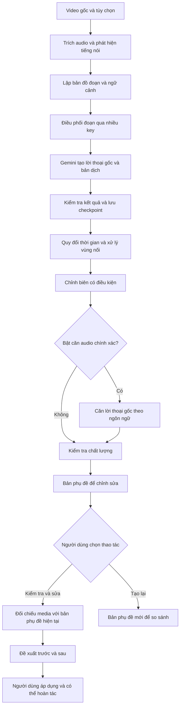

# Kế hoạch nâng cấp Gemini Subtitle Studio

Ngày tổng hợp: 12/09/2026

Trạng thái: Kế hoạch để rà soát trước triển khai; chưa phải báo cáo tính năng đã hoàn thành.

Mốc mã nguồn tham chiếu: `4cc8758`.

## 1. Mục tiêu

Nâng cấp quy trình tạo phụ đề video dài để:

- Lưu nhiều Gemini API key, không giới hạn cứng số lượng key trong ứng dụng.
- Phân phối các đoạn video cho nhiều key xử lý song song, có giới hạn tài nguyên và điều phối quota.
- Chia media ở khoảng nghỉ lời thoại, với độ dài mục tiêu khoảng hai phút, giảm nguy cơ cắt ngang câu.
- Chuyển ngay xuống model tiếp theo khi gặp lỗi quá tải `503`, theo chuỗi ưu tiên `3.8 → 3.7 → 3.6`.
- Giữ đúng trục thời gian video gốc, kiểm tra vùng nối và lưu kết quả từng đoạn để tiếp tục sau lỗi.
- Bổ sung bước căn timing có chọn lọc khi cần độ chính xác cao hơn.
- Cho người dùng chủ động chạy **Kiểm tra & sửa phụ đề bằng AI**, xem đề xuất và áp dụng có thể hoàn tác.
- Cho phép **Tạo lại phụ đề** thành bản mới khi chất lượng bản hiện tại không chấp nhận được.

Độ chính xác được đánh giá bằng dữ liệu kiểm thử. Không cam kết timing đúng tuyệt đối, không mất/lặp câu trong mọi video hoặc sai số ±10/±30 ms khi chưa có kết quả đo.

## 2. Hiện trạng và phần tận dụng

Theo mã nguồn đã khảo sát:

- `backend/app/services/gemini_subtitles.py` dùng một key, chia video theo độ dài cố định khoảng ba phút và xử lý tuần tự.
- Dịch vụ đã có upload file, retry, hủy tác vụ, quy đổi timestamp, checkpoint từng đoạn và dọn file tạm.
- Gemini key hiện nằm trong kho credential mã hóa cục bộ; có cấu hình một key từ môi trường.
- `backend/app/application_services.py` khởi tạo bộ quản lý Gemini job với một worker cấp video.
- `backend/app/services/subtitle_alignment.py` có căn theo năng lượng audio và `faster_whisper`; phần nhận dạng đang cố định `language="vi"` và đối chiếu trường `text` của cue.
- Luồng Gemini đang giới hạn tổng kết quả ở 500 cue, cần điều chỉnh để hỗ trợ video dài.
- Frontend đã có chọn model, tiến độ job, hủy và chỉnh phụ đề trong Subtitle Studio.

Tận dụng hạ tầng hiện có; bổ sung các thành phần độc lập bên trong một pipeline chung. Không nhân đôi toàn bộ hệ thống thành hai pipeline riêng.

## 3. Quyết định thiết kế đã thống nhất

| Hạng mục | Quyết định |
| --- | --- |
| Nguồn nội dung chính | Gemini xử lý hình ảnh, audio và ngữ cảnh để tạo lời thoại/bản dịch. |
| Chia đoạn | Mục tiêu khoảng 120 giây; ưu tiên khoảng nghỉ tiếng nói; không ép mọi đoạn đúng hai phút. |
| Phát hiện tiếng nói | Đề xuất Silero VAD chạy ONNX trên CPU, có phiên bản model cố định và kiểm thử đối chiếu. |
| Timeline | Ứng dụng quản lý bản đồ thời gian gốc; không giao cho LLM tự cộng thời gian toàn video. |
| Vùng nối | Ngữ cảnh chồng lấn, quyền sở hữu cue và kiểm tra đối chiếu bổ sung; không chỉ dựa vào midpoint. |
| Model quá tải | Chuyển ngay sang model tiếp theo khi gặp `503`; không bắt buộc chờ hai giây thử lại cùng model. |
| Quota | Phân biệt key với project; không mặc định nhiều key đồng nghĩa nhiều quota độc lập. |
| Căn chính xác | Thành phần tùy chọn trên pipeline chung, đối chiếu lời thoại ngôn ngữ gốc với audio tương ứng. |
| Chất lượng | Có thể giữ kết quả chưa chắc chắn và đánh dấu cần xem lại; không âm thầm xóa câu. |
| Kiểm tra lần hai | Người dùng chủ động chạy; AI tạo đề xuất, không tự ghi đè bản phụ đề đang dùng. |

Không thay đổi model mặc định hiện có chỉ vì bổ sung fallback. Chuỗi bắt đầu từ model người dùng chọn; model ngoài chuỗi không bị tự chuyển sang một họ model khác nếu chưa có cấu hình tương ứng.

## 4. Kiến trúc tổng thể

Việc sinh nội dung, quản lý ID, lưu phiên bản, hủy, checkpoint và báo tiến độ dùng chung. Bật căn audio không mặc định sinh lại bản dịch hoặc chia lại toàn bộ danh sách câu.

## 5. Quản lý nhiều API key

### 5.1. Giao diện Settings → Gemini AI

- Thêm một key hoặc dán nhiều key, mỗi dòng một key.
- Không đặt giới hạn cứng số key được lưu; danh sách dài cần tìm kiếm và hiển thị theo trang hoặc theo vùng nhìn thấy.
- Loại bỏ khoảng trắng thừa, phát hiện key trùng và báo kết quả nhập.
- Mỗi key có ID nội bộ, tên, trạng thái bật/tắt, key đã che và nhóm project tùy chọn.
- Có thao tác kiểm tra, đổi tên, bật/tắt và xóa.
- Kiểm tra key phản ánh quyền/model đã kiểm tra tại thời điểm đó, không hứa key luôn đủ quota hoặc truy cập được mọi model.
- Trạng thái gồm chưa kiểm tra, sẵn sàng, đang xử lý, đang chờ hạn mức, lỗi xác thực/quyền và đã tắt.

### 5.2. Lưu trữ và tương thích

- Lưu danh sách trong kho mã hóa cục bộ hiện có, mở rộng định dạng có phiên bản và migration.
- Cấu hình một key cũ vẫn dùng được mà không cần nhập lại; đưa vào danh sách hiệu dụng dưới một ID ổn định.
- Khi đã cấu hình danh sách mới, danh sách đó là cấu hình chính; không tự hồi sinh một key cũ đã bị người dùng tắt hoặc xóa.
- Quy định rõ thứ tự ưu tiên giữa danh sách trong vault và cấu hình môi trường; giữ đường tương thích một key và có kiểm thử.
- API đọc trạng thái, log, job, checkpoint và báo cáo chỉ chứa ID/tên đã che, không chứa key thô.
- Cập nhật vault an toàn khi có yêu cầu đồng thời; không để hai lần lưu làm mất thay đổi của nhau.
- Khi tắt/xóa key đang chạy: ngừng giao việc mới, cho request đang chạy kết thúc hoặc hủy theo tác vụ; giữ thông tin cần thiết trong bộ nhớ để dọn upload đang sở hữu.

### 5.3. Project và quota

- Cho phép gán nhóm project thủ công, không bắt buộc người dùng phổ thông nhập Project ID.
- Không suy ra project từ hình thức chuỗi key.
- Key chưa có nhóm được ghi nhận là **chưa biết project**, không coi là đã chứng minh quota độc lập.
- Những lỗi `429` giống nhau có thể là tín hiệu giảm tốc chung, nhưng không tự ghi nhận các key cùng project chỉ từ sự trùng thời điểm hoặc `Retry-After`.
- Google có `keys.lookupKey` qua API Keys API nhưng cần quyền OAuth/IAM bổ sung; không đưa vào yêu cầu bắt buộc của phiên bản đầu.
- Theo dõi hạn mức theo phạm vi biết được: project/nhóm, model và loại giới hạn. Nếu phản hồi không đủ thông tin, dùng điều phối thận trọng và ghi rõ nguyên nhân chờ.

## 6. Phân tích tiếng nói và chia đoạn

### 6.1. Audio và VAD

- Trích audio một lần theo trục thời gian nguồn; giữ thông tin offset audio/video nếu có.
- Chạy VAD theo cửa sổ có trạng thái, không cần tải toàn bộ audio dài vào RAM cùng lúc.
- Cố định phiên bản và checksum model; đọc đúng tên input/output, kích thước state và context theo model được chọn.
- Nếu dùng ONNX không PyTorch, triển khai phần đọc audio và wrapper tương ứng; không giả định wrapper gốc không có phụ thuộc PyTorch.
- Reset trạng thái ở đúng ranh giới luồng audio; không chia sẻ state giữa các video.
- Kiểm thử đối chiếu với wrapper tham chiếu cùng phiên bản, bao gồm audio chia thành nhiều lượt đọc, phần dư cuối file và xử lý nối tiếp nhiều video.
- VAD phát hiện tiếng nói, không phải bộ tách giọng khỏi nhạc và không chứng minh câu đã kết thúc. Kết quả vẫn có thể sai với nhạc, tiếng hát, nói nhỏ hoặc nói chồng nhau.

### 6.2. Chính sách chọn ranh giới

Các giá trị dưới đây là cấu hình khởi đầu để kiểm thử, chưa phải ngưỡng tối ưu đã đo:

| Thiết lập | Giá trị đề xuất |
| --- | --- |
| Độ dài mục tiêu | 120 giây |
| Vùng tìm kiếm ban đầu | 100–140 giây tính từ đầu đoạn |
| Khoảng nghỉ ưu tiên | Khoảng 0,8 giây trở lên |
| Ngữ cảnh mỗi phía | Khoảng 2 giây, điều chỉnh nếu vùng nối khó |
| Vị trí cắt | Bên trong khoảng nghỉ, có khoảng đệm với tiếng nói hai phía |

Thuật toán ưu tiên khoảng nghỉ đủ tin cậy gần mốc mục tiêu. Nếu không có, mở rộng vùng tìm kiếm và cho phép đoạn dài hơn.

**Không áp dụng trần cứng 150 giây rồi tự cắt tại điểm có xác suất tiếng nói thấp nhất.** Điểm thấp nhất vẫn có thể nằm giữa lời nói. Cần có giới hạn tài nguyên/thời gian xử lý cấu hình được; khi không tìm được ranh giới phù hợp trước giới hạn đó, trả về nguyên nhân cụ thể để người dùng điều chỉnh hoặc xử lý vùng đó riêng. Không âm thầm vi phạm yêu cầu tránh cắt ngang hội thoại.

Thời lượng đoạn và kích thước upload là hai điều kiện riêng. Bộ tạo proxy kiểm tra kích thước thực tế, không dùng mốc thời lượng như bảo đảm file đủ nhỏ. Giới hạn API và khả năng model phải được xác minh lúc triển khai.

### 6.3. Bản đồ thời gian

Lập và lưu manifest trước khi dịch, gồm:

- Dấu vân tay media, phiên bản thuật toán và thiết lập chia đoạn.
- `chunk_id`, thứ tự đoạn.
- `core_start_ms`, `core_end_ms`: phần chính trong video gốc.
- `media_start_ms`, `media_end_ms`: phần gửi Gemini, gồm ngữ cảnh.
- Lý do chọn ranh giới và vùng cần kiểm tra bổ sung.
- Offset thực tế giữa media tạo ra và nguồn nếu có.

Ví dụ:

| Đoạn | Phần chính | Phần gửi Gemini |
| --- | --- | --- |
| 1 | 00:00–01:54 | 00:00–01:56 |
| 2 | 01:54–04:03 | 01:52–04:05 |
| 3 | 04:03–06:08 | 04:01–06:10 |

Khi ghép, cộng timestamp tương đối với thời điểm bắt đầu **media thực sự gửi**, có xử lý offset đã ghi nhận. Không cộng cố định 120 giây và không cộng dồn độ dài phụ đề. Kiểm tra đầu vào có audio bắt đầu trễ, tốc độ khung hình biến đổi và sai khác seek/cắt media.

## 7. Điều phối song song và fallback

### 7.1. Phân phối công việc

- Mặc định tối đa 4 đoạn đồng thời trên toàn dịch vụ Gemini; cho phép cấu hình.
- Mỗi key mặc định nhận một đoạn đang xử lý; key rảnh nhận đoạn tiếp theo.
- Áp dụng thêm giới hạn nhóm project/model, không chỉ semaphore theo key.
- Không tạo một thread, client hoặc tiến trình nén thường trực cho mọi key được lưu.
- Hàng đợi có giới hạn; chỉ chuẩn bị trước một số đoạn để kiểm soát dung lượng tạm và RAM.
- Nén media có giới hạn riêng, dự kiến ban đầu 1–2 tiến trình tùy cấu hình máy.
- Phiên bản đầu có thể giữ hàng đợi một video như hiện tại, nhưng chạy song song các đoạn bên trong video. Giới hạn dùng key vẫn đặt ở cấp dịch vụ để không bị vượt khi bổ sung nhiều loại job.
- Tác vụ kiểm tra/sửa dùng chung bộ điều phối, tránh vượt quota khi chạy cùng tác vụ tạo phụ đề.

### 7.2. Chuỗi model

- Dùng ID model đầy đủ và danh sách khả dụng đã kiểm tra, không tự sinh tên model chỉ từ số phiên bản.
- Chuỗi dự kiến: `gemini-3.8-flash → gemini-3.7-flash → gemini-3.6-flash` khi các model này còn khả dụng và phù hợp với đầu vào/tính năng cần dùng.
- Chọn 3.8: thử 3.8 rồi 3.7 rồi 3.6. Chọn 3.7: chỉ hạ xuống 3.6. Chọn 3.6: không tự nhảy lên 3.8.
- Với `503` trong bước sinh nội dung: hạ ngay model; không chờ thử lại cùng model đang quá tải.
- Tạm bỏ qua model đã quá tải cho công việc mới trong cùng tác vụ, có phạm vi trạng thái rõ ràng theo model/nhóm. Request đang chạy có thể hoàn thành.
- Không tự nâng model trở lại giữa tác vụ ở phiên bản đầu. Job mới có thể bắt đầu lại từ lựa chọn của người dùng.
- Không vòng qua mọi key để gọi lại cùng model đang quá tải một cách không giới hạn.
- Giới hạn tổng số lần thử và tổng deadline cho mỗi đoạn, kể cả khi đổi key/model.

### 7.3. Phân loại lỗi

| Lỗi | Hành vi |
| --- | --- |
| `503` ở `generateContent` | Hạ model ngay; hết chuỗi thì kết thúc lần xử lý đoạn với thông báo rõ. |
| `429` | Phân tích loại quota nếu có; áp dụng thời gian chờ của server và chọn key/nhóm khác đủ điều kiện. Quota ngày không retry dồn trong vài giây. |
| Key không hợp lệ | Ngừng giao việc mới cho key, báo lỗi xác thực và dùng key khác khi có. |
| `403` | Phân biệt quyền key/project/model; không vô hiệu hóa toàn bộ key nếu chỉ một model thiếu quyền. |
| Model không tồn tại/không hỗ trợ | Bỏ qua khi xác định được nguyên nhân liên quan model; không coi mọi lỗi 400/404 đều là lý do fallback. |
| Timeout/mất mạng | Retry có giới hạn và thời gian chờ phù hợp; không đồng nhất với model quá tải. |
| JSON hỏng/thiếu cue | Kiểm tra schema và nội dung; chỉ sửa/chạy lại phần cần thiết trong ngân sách thử lại. |
| Bị chặn nội dung | Báo nguyên nhân phù hợp; không đổi key/model nhằm vượt cơ chế chặn nội dung. |

Lỗi upload/poll/delete thuộc File API được xử lý riêng; đổi model không giải quyết được lỗi tại các bước không dùng model.

### 7.4. Quyền sở hữu upload

- Mỗi file upload gắn với credential đã tạo nó.
- Khi chuyển project hoặc không biết chắc quyền chia sẻ, upload lại đoạn bằng key mới; không giả định URI file dùng được với mọi key.
- Dọn remote file bằng credential sở hữu; không ghi key vào metadata lưu trên đĩa.
- Khi dọn thất bại, ghi cảnh báo có thể kiểm tra lại; không làm mất kết quả phụ đề đã hợp lệ.

## 8. Dữ liệu phụ đề, ngữ cảnh và vùng nối

### 8.1. Kết quả trung gian

Mỗi cue cần có ID nội bộ ổn định sau khi nhập, thời gian, bản dịch, lời thoại gốc nếu xác định được, ngôn ngữ nguồn, chunk/model đã tạo và trạng thái kiểm tra.

- Lưu lời thoại gốc nội bộ ngay cả khi người dùng không bật hiển thị song ngữ. Không phụ thuộc hoàn toàn vào `secondary_text` của giao diện.
- Ngữ cảnh dùng chung gồm quy tắc xưng hô, tên riêng/thuật ngữ người dùng cung cấp và thông tin đã xác nhận từ tác vụ. Không tạo một chuỗi phụ thuộc bắt buộc giữa tất cả các đoạn chỉ để lấy ngữ cảnh.
- Giữ liên kết giữa lời thoại gốc và bản dịch; không yêu cầu số từ hai ngôn ngữ giống nhau.
- Nếu thêm nhãn nguồn nội dung, coi đó là bằng chứng do model cung cấp, có trạng thái `unknown`. Không dùng nhãn như sự thật tuyệt đối.
- Timestamp nằm trong phạm vi media gửi, cue có thời lượng dương, ID không trùng; cảnh báo hoặc từ chối kết quả không hợp lệ.
- Đoạn không có lời thoại có thể hợp lệ với danh sách cue rỗng. Không retry vô hạn chỉ vì không có cue; cần phân biệt với đoạn có bằng chứng tiếng nói bị bỏ sót.

### 8.2. Quyền sở hữu và đối chiếu vùng nối

- Quy đổi tất cả kết quả về timeline gốc trước khi đối chiếu.
- Midpoint có thể làm tiêu chí sở hữu ban đầu, nhưng không phải bằng chứng loại trùng hoàn chỉnh vì hai lần sinh có thể trả timestamp và cách chia câu khác nhau.
- Đối chiếu cả thời gian, lời thoại nguồn và thứ tự các cue lân cận; xử lý trường hợp một cue bên này tương ứng nhiều cue bên kia.
- So khớp theo ngôn ngữ: không dùng duy nhất ngưỡng tương đồng 0,7 hoặc trọng số 70/30 chưa đo.
- Unicode NFKC không thay thế chuyển đổi giản thể/phồn thể hay phiên âm. Các phép chuyển đổi dùng cho so khớp phải rõ ràng, giữ nguyên văn bản nguồn để đối chiếu.
- Chỉ tự gộp/xóa khi đủ bằng chứng; trường hợp mơ hồ giữ dấu vết và đánh dấu vùng cần kiểm tra hoặc gửi một clip bao trùm ranh giới để xác minh.
- Không xóa mọi câu giống nhau: nhân vật có thể thực sự lặp lại lời nói.
- Không coi giao với VAD trên 50% là chứng minh cue đến từ audio, hoặc overlap bằng 0 là chứng minh cue đến từ OCR.

### 8.3. Chỉnh biên và căn chính xác

Chỉnh theo VAD chỉ áp dụng khi có bằng chứng cue tương ứng với tiếng nói và có ranh giới audio phù hợp gần đó. Không kéo mọi cue về đầu/cuối vùng tiếng nói có overlap lớn nhất.

- Một vùng nói liên tục có thể chứa nhiều câu; VAD không cung cấp ranh giới câu bên trong.
- Giới hạn mức dịch chuyển cấu hình được, giữ thứ tự và kiểm tra cue chồng lấn sau chỉnh.
- Cue OCR, cue đã khóa hoặc nguồn chưa rõ không tự bị kéo vào vùng tiếng nói.
- Có thể hoàn tác các thay đổi; lưu lý do và nguồn timing.

Bước căn audio chính xác là thành phần tùy chọn:

- Căn lời thoại nguồn bằng ngôn ngữ tương ứng, rồi gắn timing về cue/bản dịch qua liên kết đã lưu.
- Sửa phần cố định `language="vi"` của mã hiện tại. Chọn engine/model có hỗ trợ ngôn ngữ nguồn; nếu không hỗ trợ, báo rõ và giữ kết quả hiện tại.
- Không căn trực tiếp bản dịch tiếng Việt với audio ngoại ngữ.
- Không tự sửa văn bản tiếng Việt hoặc chia lại danh sách cue khi người dùng chỉ yêu cầu căn thời gian.
- Nếu transcript nguồn sai, bị thiếu hoặc không thể ánh xạ tin cậy, đánh dấu cần kiểm tra nội dung; chỉnh timestamp đơn thuần không sửa được lỗi đó.
- Chỉ suy ra timing từ của ngôn ngữ nguồn; không gán thành timing karaoke của từng từ tiếng Việt bằng cách chia đều mà gọi là căn chính xác.
- Ưu tiên xử lý vùng có vấn đề thay vì bắt buộc căn lại toàn bộ video. Chạy toàn video là tùy chọn sau khi đánh giá tài nguyên.

## 9. Kiểm tra & sửa phụ đề bằng AI

### 9.1. Mục đích và thao tác

Bổ sung nút **Kiểm tra & sửa bằng AI** sau khi có phụ đề. Đây là lượt kiểm tra độc lập do người dùng chủ động chạy, không tự động nhân đôi số lần gọi API của mọi tác vụ.

Cho phép chọn:

- Toàn bộ video.
- Một khoảng thời gian.
- Các cue đang chọn.

Giao diện báo phạm vi và việc phát sinh thêm lượt gọi API. Nếu hiển thị ước tính chi phí/thời gian, phải phân biệt với giá trị thực tế và không tự đưa số thiếu dữ liệu.

### 9.2. Đầu vào và lỗi cần tìm

Lượt kiểm tra nhận media của vùng cần xem, phụ đề hiện tại và ngữ cảnh lân cận. Với vùng nối, gửi clip bao trùm cả hai phía thay vì chỉ nhìn riêng từng chunk cũ.

Nhóm lỗi cần kiểm tra:

- Bỏ sót lời thoại hoặc chữ trên màn hình thuộc phạm vi người dùng muốn tạo phụ đề.
- Thêm nội dung không có trong video.
- Dịch sai nghĩa, sai tên/thuật ngữ, xưng hô không nhất quán.
- Câu trùng, bị cắt cụt hoặc ghép nhầm.
- Timing sớm/muộn, sai thứ tự, chồng lấn bất hợp lý.
- Phụ đề quá dài để đọc trong thời lượng hiện có.

Prompt của lượt kiểm tra yêu cầu đối chiếu và tìm bằng chứng, không chỉ diễn đạt lại cho hay. Model kiểm tra có thể chọn riêng; model khác không mặc định được coi là tốt hơn.

### 9.3. Đề xuất sửa và phiên bản

Mỗi đề xuất có:

- ID, loại lỗi, vùng thời gian, cue liên quan và revision nguồn.
- Nội dung/timing trước và sau; có thể là sửa, thêm, xóa hoặc gộp/tách có liên kết rõ.
- Lý do, căn cứ theo media và mức chắc chắn do hệ thống/model cung cấp, không trình bày như xác suất đã được hiệu chuẩn.
- Trạng thái chờ duyệt, đã áp dụng, bỏ qua hoặc xung đột.

Người dùng có thể xem trước đoạn video, duyệt từng sửa đổi hoặc áp dụng tất cả các đề xuất hợp lệ không xung đột. Cue đã khóa chỉ nhận góp ý; không bị ghi đè tự động.

- Giữ bản phụ đề trước khi áp dụng và có hoàn tác.
- Nếu người dùng chỉnh phụ đề trong lúc AI kiểm tra, kết quả gắn với snapshot cũ; không tự áp vào cue đã thay đổi. Báo xung đột và cho kiểm tra lại.
- Backend xác minh schema, ID, phạm vi thời gian và quan hệ cue trước khi áp dụng. Không cho kết quả AI sửa ngoài phạm vi yêu cầu.
- Bản chạy lần hai không mặc định tốt hơn bản đầu; nếu không đủ bằng chứng, AI có thể không đề xuất sửa.
- Kiểm tra không phát hiện lỗi không đồng nghĩa chứng nhận phụ đề hoàn hảo.

### 9.4. Phân biệt với Tạo lại phụ đề

| Thao tác | Hành vi |
| --- | --- |
| Kiểm tra & sửa | Giữ bản hiện tại; sinh danh sách đề xuất dựa trên đối chiếu media. |
| Tạo lại phụ đề | Tạo bản mới, có thể đổi model; giữ bản cũ để so sánh và chọn sử dụng. |
| Căn lại thời gian | Giữ nội dung và danh sách cue; chỉ đề xuất/cập nhật timing theo phạm vi đã chọn. |

Tạo lại phải có revision/run mới hoặc cơ chế bỏ qua cache sinh nội dung tương ứng. Không để dedupe trả lại nguyên bản thành công trước đó khiến nút tạo lại không thực sự chạy. Có thể dùng lại media proxy/VAD còn hợp lệ để tiết kiệm công việc.

## 10. Checkpoint, hủy và phục hồi

- Lưu manifest chia đoạn và checkpoint từng đoạn một cách atomic; coordinator chịu trách nhiệm hợp nhất trạng thái để tránh race giữa worker.
- Khóa cache gồm dấu vân tay video, manifest, ngôn ngữ/tùy chọn, phiên bản prompt/schema và chính sách ảnh hưởng kết quả. Lưu model thực tế riêng với model được yêu cầu.
- Không đưa secret vào cache key hoặc file checkpoint.
- Khi thay ranh giới hoặc sửa thiết lập làm thay đổi nội dung cần sinh, không dùng nhầm checkpoint cũ.
- Chạy lại sau lỗi chỉ xử lý phần còn thiếu/hỏng; không tự dịch lại đoạn đã hoàn tất hợp lệ.
- Khi một đoạn thất bại, các đoạn độc lập đã chạy có thể hoàn tất và lưu lại. Không đánh dấu toàn video thành công nếu còn thiếu đoạn bắt buộc.
- Hủy tác vụ dừng giao việc mới, hủy hàng đợi và xử lý request/tiến trình đang chạy với timeout hữu hạn; không hứa HTTP đang xử lý trên server dừng tức thì.
- Không để future/process của tác vụ cũ ghi vào một revision hoặc workspace mới sau khi đã hủy.
- Dọn file tạm cục bộ/remote đúng quyền sở hữu. Checkpoint cần resume được giữ theo chính sách dung lượng/thời hạn rõ ràng.
- Kiểm tra/sửa cũng lưu snapshot, tiến độ và đề xuất theo revision để phục hồi mà không ghi đè bản hiện hành.

## 11. Trải nghiệm trong Subtitle Studio

- Các giai đoạn: phân tích tiếng nói → chuẩn bị đoạn → dịch → kiểm tra vùng nối → căn timing nếu bật → hoàn tất.
- Hiển thị tổng đoạn, hoàn thành, đang chạy, đang chờ quota và thất bại; tiến độ tổng không lùi do worker cập nhật lệch thứ tự.
- Chi tiết từng đoạn hiển thị tên key đã che, model thực tế và lý do chuyển/chờ/lỗi.
- Kết quả phân biệt model ban đầu với các model thực tế đã sử dụng.
- Đánh dấu cue/vùng nối cần kiểm tra, cho nhảy đến đoạn video liên quan.
- Các nút riêng: **Kiểm tra & sửa**, **Tạo lại**, **Căn lại thời gian**, **Hủy** khi đang chạy.
- Panel kiểm tra hiển thị trước/sau, lý do và thao tác áp dụng/bỏ qua/hoàn tác.
- Thiết lập nâng cao có giới hạn đồng thời và tham số chia đoạn; giao diện thường không phơi bày tensor VAD, chi tiết cache hay thông số kỹ thuật không cần thiết.

## 12. Phạm vi mã nguồn dự kiến

| Thành phần | Công việc |
| --- | --- |
| `backend/app/services/credential_vault.py`, resolver, schema/API credential | Danh sách key, migration, trạng thái đã che và nhóm project. |
| `backend/app/config.py`, `backend/.env.example` | Tương thích cấu hình cũ; giới hạn xử lý, VAD, chunk và fallback. |
| `backend/app/services/gemini_subtitles.py` | Tách logic điều phối khỏi thao tác API; tích hợp manifest, model thực tế và dữ liệu nguồn. |
| Các module Gemini mới | Registry key/quota, VAD/chunk planner, dispatcher, kiểm tra vùng nối và review; tên cụ thể chốt khi triển khai. |
| `backend/app/services/subtitle_alignment.py` | Căn theo ngôn ngữ nguồn, liên kết cue và xử lý kết quả thiếu tin cậy. |
| `backend/app/services/subtitle_jobs.py`, `backend/app/application_services.py` | Lifecycle, giới hạn toàn dịch vụ, cancel, tiến độ và job kiểm tra. |
| `backend/app/api/subtitles.py`, schemas | Request/result mới, revision, đề xuất sửa và tương thích endpoint cũ. |
| `frontend/src/SettingsModal.tsx` | Quản lý nhiều key. |
| `frontend/src/SubtitleStudio.tsx`, hooks và API types | Tiến độ đoạn, cảnh báo, kiểm tra/sửa, so sánh phiên bản và hoàn tác. |
| `backend/tests`, frontend tests | Hợp đồng dữ liệu, lỗi, concurrency, timeline và tương tác review. |
| `README.md`, tài liệu sử dụng | Thiết lập key/model, ý nghĩa giới hạn, review và xử lý lỗi. |

Định dạng job/manifest/review mở rộng cần có version và kiểm thử đọc dữ liệu cũ. Điều chỉnh giới hạn 500 cue theo nhu cầu video dài, đồng thời vẫn giới hạn kích thước request/result và tài nguyên xử lý.

## 13. Thứ tự triển khai

| Giai đoạn | Kết quả cần có |
| --- | --- |
| P0 — Chuẩn bị và baseline | Chọn video kiểm thử, đo luồng hiện tại, chốt schema/manifest/revision và phiên bản VAD. |
| P1 — Nhiều key | Vault/API/UI quản lý danh sách; migration key cũ; kiểm tra trạng thái và che secret. |
| P2 — Chia đoạn theo tiếng nói | VAD, manifest, điểm cắt linh hoạt, proxy và kiểm chứng timeline nguồn. |
| P3 — Điều phối và fallback | Hàng đợi đoạn song song, giới hạn key/nhóm/model, phân loại lỗi và chuyển ngay khi 503. |
| P4 — Hợp nhất và phục hồi | ID/dữ liệu nguồn, đối chiếu vùng nối đa ngôn ngữ, checkpoint, cancel và resume. |
| P5 — Căn timing có chọn lọc | Chỉnh biên có điều kiện, căn theo ngôn ngữ nguồn, đánh dấu vùng không đủ tin cậy. |
| P6 — Kiểm tra & sửa thủ công | Job đối chiếu media, danh sách đề xuất, duyệt/áp dụng/hoàn tác và xử lý revision xung đột. |
| P7 — Tạo lại và hoàn thiện UI | Phiên bản mới, so sánh, tiến độ toàn luồng và hướng dẫn sử dụng. |
| P8 — Nghiệm thu | Kiểm thử tích hợp, benchmark cùng tập video, báo cáo chất lượng và giới hạn còn lại. |

Mỗi giai đoạn có kiểm thử phù hợp trước tích hợp. Việc thêm review không được bỏ khỏi phạm vi khi tối ưu phần nhiều key hoặc VAD.

## 14. Kiểm thử và tiêu chí nghiệm thu

### 14.1. Bộ dữ liệu

Chọn các video đại diện có đoạn mốc được đối chiếu thủ công:

- Audio tiếng Việt và ngoại ngữ, đặc biệt tiếng Trung/Nhật; có giản thể/phồn thể và câu ngắn lặp lại.
- Hội thoại đi qua mốc hai phút, nói liên tục, khoảng nghỉ ngắn và nói chồng nhau.
- Nhạc nền lớn, nói nhỏ, tiếng hát, đoạn không có lời thoại.
- Sub cứng cùng lời nói; chữ chú thích trong im lặng; chữ chú thích trùng thời gian với lời nói khác.
- Video dài, audio/video lệch điểm bắt đầu, tốc độ khung hình biến đổi.

### 14.2. Kiểm thử tự động

- Migration vault, thêm/xóa/tắt/loại trùng key; danh sách lớn hơn nhiều mức đồng thời vẫn hoạt động.
- Không lộ key trong response/log/checkpoint; cập nhật credential không mất dữ liệu.
- VAD khớp wrapper tham chiếu cùng phiên bản, reset đúng, độc lập giữa video và đọc audio từng phần.
- Ranh giới không bị ép cắt tại cực tiểu trong vùng vẫn có tiếng nói; xử lý rõ trường hợp không tìm được khoảng nghỉ.
- Quy đổi timestamp dùng offset thực tế, kể cả ngữ cảnh và media có start offset.
- Worker hoàn thành sai thứ tự nhưng ghép đúng; không vượt giới hạn xử lý và không giao trùng đoạn.
- 503 chuyển đúng thứ tự, không quay vòng; 429 xử lý theo phạm vi quota; phân biệt lỗi key, quyền model và File API.
- Chuyển project không dùng nhầm upload; cleanup dùng đúng credential sở hữu.
- Midpoint lệch hai phía, cue một–nhiều, lời nói lặp thật và OCR chồng tiếng nói không bị loại sai một cách máy móc.
- Hủy/restart/race không làm hỏng checkpoint; chạy lại chỉ làm phần còn thiếu; không báo thành công khi thiếu đoạn.
- Căn ngoại ngữ dùng transcript nguồn; khóa cue được giữ; ghi độ phân giải 10 ms không bị coi là chứng minh độ chính xác.
- Review tìm các lỗi được cài có chủ đích, kiểm tra tỷ lệ sửa sai/false positive; không chỉ kiểm tra schema.
- Áp dụng đề xuất không vượt phạm vi, không ghi đè revision đã đổi; khóa, bỏ qua, áp dụng tất cả và hoàn tác hoạt động.
- Tạo lại sinh một bản mới thực sự; bản cũ còn nguyên và cache media phù hợp vẫn có thể tái sử dụng.

### 14.3. Đo chất lượng và hiệu năng

So sánh cùng tập video giữa baseline và pipeline mới, bật/tắt căn bổ sung khi cần:

- Sai lệch thời điểm bắt đầu/kết thúc so với nhãn tham chiếu; báo trung vị, p95 và trường hợp xấu nhất.
- Số câu thiếu, thừa, lặp hoặc sai liên kết tại điểm nối và toàn video.
- Sai nghĩa, tên riêng, xưng hô và mức dễ đọc của bản dịch qua kiểm tra mẫu.
- Độ lệch tại đầu/giữa/cuối video để phát hiện sai số tích lũy.
- Thời gian tổng, thời gian từng bước, CPU/RAM/GPU, dung lượng tạm và dữ liệu upload.
- Lượt gọi API, model fallback, lỗi 429/503 và chi phí nếu có dữ liệu usage/billing đáng tin cậy.
- Với review: lỗi thật được sửa, lỗi bị bỏ sót và đề xuất làm kết quả xấu hơn.

Không lấy benchmark quảng bá của thư viện làm kết quả của Content Bot. Trước P8 cần chốt ngưỡng chấp nhận từ baseline và nhu cầu sử dụng; không ghi một con số chính xác giả tạo ngay trong kế hoạch.

Điều kiện chức năng bắt buộc: không mất/lặp câu do cơ chế ghép trong các fixture đã xác định, không lệch tích lũy do phép quy đổi thời gian, không vượt giới hạn đồng thời, không mất bản phụ đề người dùng đang chỉnh và phục hồi đúng sau lỗi. Độ chính xác nhận dạng/dịch trên video thực tế phải được báo riêng với giới hạn còn lại.

## 15. Những việc không mặc định đưa vào phiên bản đầu

- Tự tra project bằng OAuth Google Cloud hoặc tự kết luận nhóm project từ lỗi 429.
- Tự nâng model trở lại giữa tác vụ theo thời gian nghỉ cố định chưa đo.
- Cắt bắt buộc ở 150 giây bất kể đang có hội thoại.
- Xóa cue chỉ bằng midpoint, một ngưỡng tương đồng chuỗi hoặc một tỷ lệ giao VAD.
- Tách giọng khỏi nhạc cho mọi video; chỉ đánh giá bổ sung nếu bộ kiểm thử cho thấy cần thiết.
- Bắt buộc ASR/căn toàn video trên mọi máy; không nhân đôi toàn bộ pipeline.
- Tự chạy lượt kiểm tra thứ hai hoặc tự áp dụng sửa đổi khi người dùng chưa chọn thao tác.
- Cam kết độ chính xác tuyệt đối hoặc coi bản chạy lại luôn tốt hơn.

## 16. Nguồn tham khảo và cách áp dụng

Các nguồn dùng để tham khảo cơ chế, không chứng minh trực tiếp chất lượng trên dữ liệu của Content Bot:

- [WhisperX — bài nghiên cứu VAD Cut & Merge và forced alignment](https://arxiv.org/abs/2303.00747): cơ sở tách phát hiện tiếng nói, nhận dạng và căn thời gian.
- [WhisperX — cách dùng và giới hạn](https://github.com/m-bain/whisperX): căn theo ngôn ngữ, hạn chế với lời nói chồng nhau và từ không căn được.
- [VideoLingo — dịch nhóm câu có ngữ cảnh và xử lý song song](https://github.com/Huanshere/VideoLingo/blob/main/core/_4_2_translate.py): tham khảo ngữ cảnh chung và hợp nhất theo thứ tự.
- [VideoLingo — chuẩn bị và chia audio](https://github.com/Huanshere/VideoLingo/blob/main/core/asr_backend/audio_preprocess.py): tham khảo tìm khoảng nghỉ; không sao chép fallback cắt cứng trái yêu cầu dự án.
- [Silero VAD](https://github.com/snakers4/silero-vad) và [wrapper tham chiếu](https://github.com/snakers4/silero-vad/blob/master/src/silero_vad/utils_vad.py): phiên bản ONNX, state/context và tham số phát hiện tiếng nói.
- [faster-whisper](https://github.com/SYSTRAN/faster-whisper): word timestamps, VAD, CPU/GPU và batch.
- [stable-ts](https://github.com/jianfch/stable-ts): chỉnh biên, refinement và chia/gộp theo khoảng nghỉ, dấu câu, độ dài.
- [OpenCC](https://github.com/BYVoid/OpenCC): chuyển đổi giản thể/phồn thể khi cần hỗ trợ so khớp.
- [Gemini troubleshooting](https://ai.google.dev/gemini-api/docs/troubleshooting) và [rate limits](https://ai.google.dev/gemini-api/docs/rate-limits): phân biệt lỗi tạm thời với hạn mức và xử lý retry.
- [Google API Keys API — lookupKey](https://docs.cloud.google.com/api-keys/docs/reference/rest/v2/keys/lookupKey): tra project có điều kiện OAuth/IAM, không phải khả năng sẵn có chỉ từ Gemini key.

Khả năng model, giới hạn API và phiên bản thư viện cần được xác minh lại khi bắt đầu triển khai phần tương ứng.
