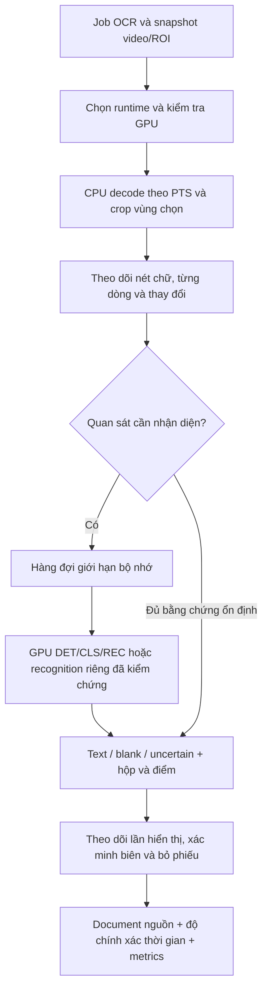

# Kế hoạch triển khai tối ưu OCR

**Kế hoạch triển khai hiện hành:** [Kế hoạch hợp nhất tăng tốc OCR](OCR_ACCELERATION_PLAN.md), gồm tối ưu ROI/copy, giảm lượt nhận dạng và tận dụng GPU. Dùng thứ tự triển khai trong tài liệu mới cho công việc tiếp theo; tài liệu này giữ bằng chứng lịch sử, quy trình ground truth và chi tiết tham khảo. Các mục lộ trình 1.1, 5 và 11 dưới đây đã được hợp nhất, không phải ba kế hoạch cần triển khai riêng.

**Phân công mới:** Codex chỉ sửa code; người dùng tự kiểm tra và benchmark. Các yêu cầu test/corpus/nghiệm thu bên dưới là tài liệu tham khảo, không phải công việc hoặc điều kiện chặn Codex trong đợt sửa code tiếp theo.

**Cập nhật 2026-09-25:** `rapidocr-v7-caption-continuity` sửa tách vụn do OCR đọc cùng chữ thành `大`/`天`/`犬`. Chỉ nối biến thể khi có bằng chứng nét chữ sáng, viền tối khớp với một mốc cố định; chọn text theo thời lượng và confidence, giữ khoảng trống thật, đánh dấu cần kiểm tra. Đã kiểm tra hồi quy và đoạn 7 giây đầu của video lỗi bằng CPU; chưa nghiệm thu toàn video/GPU hoặc benchmark tốc độ. Chi tiết và giới hạn ở [mục 6 kế hoạch hiện hành](OCR_ACCELERATION_PLAN.md#6-cách-triển-khai-và-trạng-thái-hiện-tại). Các số đo bên dưới thuộc các mốc lịch sử trước v7.

Ngày lập: **2026-09-20**. Trạng thái: **OCR-01 đã tích hợp worker CUDA tách tiến trình và CPU fallback. OCR-00 có instrumentation, ba lượt cold worker mới trên video 144 giây (median 93,767 giây) và một lượt chẩn đoán stage 88,699 giây; tất cả dùng CUDA cho DET/CLS/REC và khớp 60/60 cue với reference. Gói v4 blind chưa đạt vì candidate đặt cạnh inventory. Gói v5 blind-first và validator đã triển khai; gói review hiện ở `artifacts/subtitle-remediation/phase7-ocr/ocr-00-ground-truth-review-20260920-v5-blind-first-final-r3/`. Timeline đo được 143.978 giây, chia 29 cửa sổ; 117 candidate 3 FPS/1 FPS được chuyển vào reconciliation riêng. Validator rehash source video, kiểm tra inventory/coverage, lock, provenance metrics, candidate snapshot, text cho cặp matched một-một và timing/overlap. Inventory và review của người thật vẫn pending; chưa bật thay đổi thuật toán lấy mẫu/refinement.**

Liên kết: [kế hoạch phụ đề tổng thể](SUBTITLE_REMEDIATION_AND_OPTIMIZATION_PLAN.md), [benchmark đã đo](../artifacts/subtitle-remediation/phase7-ocr/benchmark-summary.md).

**Bổ sung theo yêu cầu ngày 2026-09-20:** ưu tiên OCR nhanh hơn, không đặt mức sử dụng GPU cố định. Xem [mục 11](#11-kế-hoạch-tăng-tốc-ocr-và-tận-dụng-gpu): số đo tác vụ thực mới nhất, thứ tự thử nghiệm, cấu hình khởi điểm và tiêu chí nhận/loại. Đây là kế hoạch triển khai; chưa bật prefetch, batch hoặc thay đổi thuật toán.

## 1. Quyết định và phạm vi

Kiến trúc đích trên máy RTX 4050: **CPU giải mã video, theo dõi thay đổi hình ảnh và chuẩn bị crop; GPU chạy DET/CLS/REC; OCR bổ sung tập trung vào khoảng chuyển câu hoặc quan sát không chắc chắn.** Máy không dùng được CUDA vẫn có đường CPU được kiểm thử.

Thứ tự cập nhật: cố định bằng chứng → giữ runtime GPU đã tích hợp → giảm OCR dò biên → đo CPU/GPU chạy gối nhau → cache theo vùng chữ → recognition riêng → thử batch/model nếu còn lợi ích. Prototype prefetch giữ nguyên hành vi có thể làm trong lúc hoàn thiện nhãn; xem mục 11 để tách thứ tự thử nghiệm với điều kiện bật mặc định.

Giữ model PP-OCRv3, cấu hình resize và mốc lấy mẫu 3 FPS của phép đo ban đầu trong các bước đầu. Không hạ mặc định xuống 1 FPS, không ép recognition sang CPU, không đưa con số 4–7 giây thành cam kết. Chỉ bật mặc định một thay đổi khi vượt kiểm tra chất lượng và hiệu năng cùng đầu vào.

Phạm vi gồm OCR, runtime liên quan, diagnostics và giao diện trạng thái trích xuất. Không thay timing bằng ASR/VAD, không tự sửa bản dịch, không thay model TTS/render. Giữ snapshot video/revision và cơ chế bảo vệ chỉnh sửa hiện có.

### 1.1. Trình tự triển khai và cổng phụ thuộc

Bảng dưới ghi các hạng mục và cổng chất lượng; thứ tự thử nghiệm mới nhất ở mục 11 cho phép đo OCR-05 độc lập trước OCR-03/04. OCR-01 đã có bằng chứng runtime và parity riêng; điều đó chưa duyệt chất lượng thuật toán. Mỗi candidate phải có baseline xác định, chạy cùng điều kiện và giữ cờ rollout tắt cho tới khi đạt điều kiện nghiệm thu tương ứng.

| Thứ tự | Việc cần làm | Đầu ra bàn giao | Điều kiện để chuyển bước |
| --- | --- | --- | --- |
| 0 — Hoàn tất OCR-00 | Người kiểm lập danh sách mọi lần phụ đề xuất hiện trong clip 144 giây, kể cả câu OCR bỏ sót; điền text, khoảng thời gian/độ bất định, dòng/ROI, người kiểm và ngày. Đối chiếu từng candidate OCR với danh sách đầy đủ, xử lý bất đồng; duyệt riêng 29 cửa sổ quét và khác biệt 1 FPS/3 FPS. Chọn, gán nhãn và khóa manifest calibration/holdout theo phim/nguồn. Chạy lại baseline app-worker cold ít nhất 3 lượt để có mốc tốc độ. | Bộ nhãn occurrence đầy đủ, `quality-review.md` đã ký duyệt, manifest corpus và baseline hiện tại có thể tái lập cùng provenance đầy đủ. | Không còn khoảng video chưa được rà; candidate không tự được xem là đáp án; nguồn liên quan không rò giữa calibration và holdout; ngưỡng chất lượng tuyệt đối được chốt trước khi mở holdout. Provenance benchmark cũ không thể khôi phục thì phải ghi là giới hạn lịch sử, không để pending như việc có thể hoàn tất. |
| 1 — Giữ OCR-01 làm baseline runtime | Giữ GPU cho cả DET/CLS/REC, CPU cho decode/chuẩn bị; không đổi cách trích xuất. CPU-only fallback và worker app đã được kiểm thử; mọi sửa runtime sau này phải qua cùng bộ smoke và parity. | Runtime CUDA/CPU có fingerprint, provider từng stage, fallback/cancel và kết quả benchmark gắn với lượt chạy. | Provider thật đúng; không có lỗi worker/cancel/fallback. Tách rõ thời gian cold app-worker với thời gian inference; không dùng một lượt 91,013 giây làm mốc cuối. |
| 2 — OCR-02 refinement chọn lọc | Theo dõi frame/PTS và trạng thái từng dòng; chỉ thay cách chọn frame refinement, giữ các mẫu OCR hiện tại ở 3 FPS; vùng không chắc chắn quay về refinement đầy đủ. Tuning chỉ trên calibration. | Phiên bản tracker có feature flag tắt mặc định, trace giải thích mỗi lần OCR được giữ/bỏ và báo cáo A/B. | Qua fixture chuyển nhanh/lặp/số/phủ định/multiline/PTS và review holdout; không thêm occurrence mất/gộp/critical error; timing không xấu hơn; giảm refinement là có thật và wall-time giảm vượt nhiễu đo. |
| 3 — OCR-03 cache vùng | Thêm cache theo track/dòng với kiểm tra định kỳ; đổi ký tự, hộp hoặc trạng thái bất định phải vô hiệu cache ngay. | Báo cáo cache hit/miss, lý do, chi phí tracker và lỗi stale-cache. | Chứng minh cache hit trên nền động, không giữ chữ cũ và cải thiện median end-to-end; nếu không thì giữ OCR-02. |
| 4 — OCR-04 recognition reuse | Thử rec-only trên hình học ổn định; khi hộp/chất lượng nghi ngờ thì gọi detector đầy đủ. Tách thử GPU/CPU recognition khỏi thay đổi resize/batch. | Adapter có đường fallback và phép so sánh theo DET/CLS/REC calls. | Model thật giữ đúng nội dung/thứ tự dòng trên corpus; giảm DET và giảm wall-time tổng, gồm chuyển dữ liệu. |
| 5 — OCR-05 CPU/GPU overlap | Đo độc lập trên baseline và bản selective refinement đã đạt, theo mục 11; gối CPU decode/chuẩn bị crop với một consumer GPU sở hữu tracking, qua queue giới hạn. Không chạy nhiều model OCR song song trên GPU 6 GB. | Đo queue wait, GPU wait, bytes/peak RAM, PTS ordering, cancel và worker cleanup. | Có lợi ích sau khi tính startup/queue; không mất frame, deadlock, tăng RAM theo thời lượng hoặc lỗi hủy. |
| 6 — OCR-06 nghiệm thu/bật dần | Kiểm thử từ UI/API tới source document, cache, đổi video, sửa trong lúc chạy, reload, cancel, restart và cài sạch; bật từng feature flag, kiểm tra rollback/cache namespace. | Runbook, test E2E, trạng thái/progress rõ ràng và phương án rollback thực chạy. | Corpus holdout, runtime, tài nguyên, publication và rollback đều đạt; nếu chưa đủ media thì không bật mặc định tối ưu thuật toán. |
| 7 — OCR-07 thử nghiệm tùy chọn | Chỉ profiling phần còn nghẽn rồi thử riêng model, batch, precision hoặc FPS. | Bảng ablation so với phiên bản đã duyệt. | Chỉ nhận thay đổi có chất lượng đạt và lợi ích đo được; không áp con số ViralCrawl 4–7 giây làm ngưỡng nghiệm thu. |

**Việc kế tiếp ngay lúc này:** hoàn thành OCR-00. Gói v4 có 60 candidate OCR và 29 cửa sổ rà nhưng đặt candidate/diff/crop cạnh nguồn video; chỉ ghi nhãn các candidate sẽ tạo thiên lệch bỏ sót. Gói v5 tách inventory trống khỏi phần reconciliation; trang đầu không có OCR text/count, candidate/diff/crop nằm dưới `reconciliation/`, và validator rehash video thật, kiểm tra coverage, lock, provenance metrics, candidate snapshot, text cặp matched một-một và giao nhau thời gian trước khi chấm. Đây là quy trình blind theo thứ tự, không phải rào cản truy cập; reviewer phải giữ phần reconciliation đóng cho tới khi freeze. Lệnh freeze hiện fail đúng vì reviewer chưa hoàn tất 29 cửa sổ. Clip không có phụ đề nhúng và chưa tìm được SRT ghép đúng nguồn, nên người kiểm phải quét hết timeline để tạo đáp án độc lập. Không bắt đầu hiệu chỉnh OCR-02 trước khi nhãn được adjudicate.

### 1.2. Giao thức ground truth OCR-00

1. Mở trang `index.html` và video nguồn; không mở `reconciliation/` cho đến khi lượt blind được freeze. Trang blind không hiển thị OCR text, số candidate, mốc thời gian candidate, diff hoặc crop mẫu. Candidate vẫn nằm trong thư mục con của cùng gói, nên việc không xem trước là quy trình reviewer chứ không phải bảo đảm truy cập bằng mật mã. Ghi việc tuân thủ này trong `quality-review.md`.
2. Quét liên tục từng cửa sổ nửa mở `[start_ms,end_ms)` trong `review_windows.csv`; các cửa sổ phải ghép chính xác `[0,duration_ms)` không hở/chồng. Cửa sổ rỗng phải được xác nhận `none_visible`; chưa xem hoặc không kết luận được thì không được đánh dấu hoàn tất.
3. Ghi `occurrences.csv` độc lập với OCR: một occurrence là một lần hiển thị liên tục của một khối phụ đề. Khối nhiều dòng giữ nguyên trong một occurrence; đổi text hoặc biến mất rồi hiện lại thì tạo occurrence mới; chỉ đổi màu/vị trí khi text giữ nguyên thì không tách. Gồm dialogue/SDH và lời bài hát được trình bày như phụ đề; bỏ qua biển hiệu thuộc cảnh, UI, watermark/logo, credits và chữ nền. Chọn một quy tắc nhất quán cho clipped/fade/karaoke và ghi trường hợp ngoại lệ.
4. Mốc thời gian tính từ frame giải mã đầu tiên, đơn vị millisecond nguyên, interval hiển thị nửa mở. Ghi nominal `start_ms/end_ms` và khoảng chấp nhận riêng (`start_min/max_ms`, `end_min/max_ms`). `within_bounds` nghĩa biên candidate nằm bên trong khoảng bất định mà reviewer đã ghi; không cộng thêm dung sai một frame toàn cục vì khoảng này đã bao hàm độ phân giải quan sát và tránh tạo false pass ở video VFR. Nếu caption đã hiện ở frame đầu hoặc vẫn hiện ở frame cuối thì đánh dấu censored; không tính biên bị cắt khỏi clip vào timing score. Uncertainty không đồng nghĩa `uncertain`: subtitle nhìn thấy nhưng mờ/che được ghi occurrence với `partially_unreadable` hoặc `unreadable`; vẫn tính phát hiện/timing nhưng loại khỏi CER toàn text. Chỉ dùng `review_status=ambiguous` khi reviewer không thể xác nhận sự kiện.
5. Gán occurrence ID vào mọi cửa sổ giao với khoảng có thể có của nó. Lưu reviewer và timestamp UTC cho từng occurrence/cửa sổ. Validator từ chối missing/duplicate/unknown ID, JSON ID sai, biên thời gian ngoài clip, trạng thái pending, window gap/overlap, và occurrence thiếu ở cửa sổ giao biên.
6. Chạy `validate_subtitle_ocr_ground_truth.py freeze-blind`. Lệnh chỉ tạo lock khi inventory/cửa sổ đầy đủ về cấu trúc; lock giữ SHA-256 của manifest, hai CSV và video cùng duration/count. Nếu thay nội dung sau đó, phải chủ động mở lại lượt blind và tạo lock mới; `validate` sẽ từ chối hash không khớp.
7. Sau lock mới mở `reconciliation/index.html`. Mỗi candidate được định danh bằng run hash và adjudicate riêng cho baseline 3 FPS hoặc comparison 1 FPS. `occurrence_ids=[]` là extra/false positive; nhiều occurrence trong một candidate là merge; nhiều candidate nối cùng occurrence phải phân biệt split với duplicate; kết hợp hai quan hệ là split_merge. Occurrence không được candidate nào nối vào được tính miss. Tách trạng thái nội dung và timing; occurrence unreadable không bị ép chấm CER. Với `matched` một-một, validator đối chiếu `exact`/`text_error` bằng Unicode NFC và chuẩn hóa khoảng trắng, giữ nguyên dấu câu, số và phủ định; text của split/merge vẫn do người kiểm adjudicate. Mọi candidate phải giao khoảng thời gian của từng occurrence được nối; biên timing của split/duplicate/split_merge được ghi `not_applicable` và báo là chưa chấm chính xác. Validator bắt buộc mỗi candidate dự kiến xuất hiện đúng một lần, structure khớp đồ thị mapping và không còn `unresolved`.
8. Chạy `validate` để nhận summary theo run (miss/extra/split/merge), hash blind inventory và hash bảng reconciliation. Reviewer ký `quality-review.md`, xác nhận không mở candidate trước lock, quét đủ timeline và ghi người adjudicate. Validator chứng minh consistency của dữ liệu, không thể chứng minh người đó đã xem mọi frame hoặc chưa nhìn thấy thư mục con. Với clip nghiệm thu chính, nên có lượt xem blind độc lập thứ hai và adjudicate khác biệt trước khi mở calibration.

Ground truth này mới cho phép đánh giá clip 144 giây; nó chưa tự đáp ứng mục tiêu 12 nguồn độc lập (4 calibration/8 holdout). Không chuyển OCR-00 thành complete hoặc mở OCR-02 chỉ vì validator pass hay parity CPU/GPU 60/60; cần cả review thủ công, provenance, kiểm tra holdout và corpus được chia theo nguồn.

## 2. Bằng chứng và giới hạn

### 2.1. Benchmark của Content Bot

- Video: `data/videos/upload/d8b5b6f8fa554a0dad2d84b65c4f0f28.mp4`, 144 giây, 1920×1080, HEVC, 29.97 FPS.
- SHA-256: `726CB57CC9015621EF359012FDA65A40876CCA130CB389D933EDBD9308886DC5`.
- ROI: x=10%, y=86%, rộng=78%, cao=14%. Model: PP-OCRv3 đang đóng gói.
- Máy đo: RTX 4050 Laptop 6 GB. So sánh chính cùng ONNX Runtime 1.26.0; runtime GPU/CUDA 12/cuDNN được đặt riêng trong artifact benchmark.

| Cấu hình | FPS | Thời gian | Tổng lượt OCR | Lượt dò biên | Số đoạn |
| --- | ---: | ---: | ---: | ---: | ---: |
| CPU, ORT 1.26 | 3 | 449,567 s | 1.549 | 1.117 | 60 |
| DET GPU, CLS/REC CPU | 3 | 289,490 s | 1.549 | 1.117 | 60 |
| DET/CLS/REC GPU | 3 | 84,244 s | 1.549 | 1.117 | 60 |
| Toàn GPU, chạy lại | 3 | 84,240 s | 1.549 | 1.117 | 60 |
| Worker CUDA qua supervisor ứng dụng, lượt trước | 3 | 91,013 s | 1.549 | 1.117 | 60 |
| Worker CUDA qua supervisor ứng dụng, 3 lượt cold mới (median; min–max) | 3 | 93,767 s (93,697–110,197) | 1.549 | 1.117 | 60 |
| Toàn GPU | 1 | 106,548 s | 2.794 | 2.650 | 57 |
| CPU, ORT 1.28 của backend | 3 | 473,653 s | 1.549 | 1.117 | 60 |

CPU/GPU ORT 1.26 giống text 60/60 đoạn; 59/60 cặp thời gian giống hoàn toàn, một biên lệch 100 ms. Hai lần toàn GPU giống cả text và timing. Đây là bằng chứng tương đương giữa cấu hình, **chưa phải bằng chứng OCR đúng với đáp án thủ công**.

Lượt tích hợp ban đầu ngày 2026-09-20 qua worker ứng dụng mất 91,013 giây (91,052 giây toàn bài đo); đó mới là một lượt. Để tạo mốc cold app-worker có provenance, smoke test nay có tùy chọn lưu manifest JSON cho từng lần chạy. Ba lượt độc lập sau đó mất **93,697 / 93,767 / 110,197 giây ở worker** (test end-to-end 93,731 / 93,800 / 110,235 giây), median worker **93,767 giây**, range 16,5 giây. Giữ cả lượt chậm nhất trong thống kê; ba lần chưa đủ để suy P95 hay ổn định dài hạn. Mỗi lượt dùng thư mục cache tạm mới nên không tái sử dụng kết quả OCR; cả DET/CLS/REC có `CUDAExecutionProvider` đầu tiên và đủ 60 cue giống chính xác text/start/end của reference. Một lượt chẩn đoán bổ sung mất 88,699 giây, cũng khớp reference; không gộp vào median ba lượt vì smoke harness đã đổi để lưu thêm thông tin. Lượt này ghi decode 10,17 giây, chuẩn bị ảnh 16,13 giây, tổng OCR call wall 52,71 giây (trong đó refinement 34,40 giây với 1.117 lượt; mẫu 18,21 giây), tracking 0,37 giây. Đây là tín hiệu profiling cho OCR-02, chưa phải lý do bỏ refinement trước quality gate. Dữ liệu từng lượt và `summary.json` nằm trong `artifacts/subtitle-remediation/phase7-ocr/ocr-00-supervisor-repeat-20260920/` (Git ignored), kèm command invocation. Ba manifest baseline ghi hash video/model/source liên quan, runtime, providers, config, metrics và cues; manifest chẩn đoán bổ sung hash runtime profile, power scheme và stage timings. Benchmark lịch sử vẫn thiếu provenance hồi tố; lượt mới đã có provenance để tái lập về sau. Mẫu VRAM qua `nvidia-smi` là mức dùng toàn thiết bị ở thời điểm lấy mẫu, không phải số riêng tiến trình hay đỉnh tuyệt đối.

Đã chạy thêm clip thật 8 giây khi profile CUDA không tồn tại: `auto` trả kết quả từ CPU ORT 1.28.0, gắn cảnh báo fallback và hoàn tất trong 9,444 giây. Nếu job OCR gần nhất chỉ thành công nhờ CPU fallback, lần POST tiếp theo sẽ tạo lượt mới thay vì dedupe vĩnh viễn vào kết quả CPU cũ; khi CUDA thành công thì kết quả tiếp tục được dedupe bình thường.

Ở 1 FPS, báo cáo so chuỗi ghi bốn caption vắng cùng một caption đổi/tách; không suy số câu mất chỉ từ chênh lệch 60−57. Cache ảnh chính xác có 0 hit ở hai lần toàn GPU 3 FPS. 1.117/1.549 ≈ 72,1% là tỷ lệ **số lượt**, không phải tỷ lệ thời gian.

### 2.2. Tham khảo ViralCrawl

Đã trích các module `ocr_text.pyc`, `dai_sub_rapid.pyc` từ bộ cài 1.9.13 bằng công cụ đọc archive; không chạy bộ cài hoặc benchmark ứng dụng. SHA-256 bộ cài: `5D90788CAC47D76357077E38F18AAA846AE9DF8D3C33176829331057D90A4AA3`.

Đọc được tên hàm, hằng số, cấu trúc code object và docstring của bytecode Python 3.11. Trình disassemble Python 3.13 không tương thích; không coi lần khảo sát này là phục dựng hoàn chỉnh mọi nhánh thực thi hoặc xác minh cấu hình người dùng của app.

| Ý tưởng thấy trong module | Áp dụng vào kế hoạch |
| --- | --- |
| Dò dải chữ ổn định, crop theo dải | Tái dùng auto-probe đang có; ROI người dùng chọn không cần dò lại khi tắt auto-probe. Không ép mọi video chỉ có sub đáy. |
| Mask/IoU, cache, hysteresis | Thiết kế bộ theo dõi thay đổi vùng chữ; hiệu chỉnh trên corpus riêng. Một ngưỡng IoU không chứng minh hai câu giống nhau. |
| Tái dùng hộp, recognition riêng | Thử sau khi theo dõi vùng chữ ổn định; có đường quay lại detector khi hình học hoặc độ tin cậy thay đổi. |
| Bỏ phiếu cả chuỗi, lọc watermark | Chỉ bỏ phiếu trong cùng một lần hiển thị đã xác định; không ghép ký tự chưa từng quan sát. Lọc watermark riêng, mặc định bảo thủ. |
| GPU dò, CPU đọc; kiểm tra provider/VRAM | Học cách kiểm tra runtime thật. Việc chọn CPU đọc và ngưỡng 1.700 MiB của họ không chuyển nguyên sang máy mình. |

Các ghi chú tăng tốc và model trong bytecode là thông tin của tác giả, chưa được tái đo. Hàm FPS thích ứng thuộc nhánh dò; nhánh đọc có cơ chế kiểm tra mask riêng. Không quy cả pipeline thành đúng 120 frame hay 30–50 lượt model cho mọi video 120 giây.

## 3. Điểm xuất phát trước khi triển khai OCR-01

Bảng này ghi lại trạng thái lúc lập kế hoạch; worker CUDA, provider validation, runtime signature và khóa GPU đã được xử lý trong OCR-01 bên dưới.

| Vị trí | Hiện trạng đã đối chiếu | Hệ quả |
| --- | --- | --- |
| `backend/app/services/subtitle_ocr.py::_get_ocr_engine` | Khởi tạo RapidOCR, chưa tích hợp cấu hình GPU đã benchmark | App chưa hưởng kết quả 84 giây. |
| Vòng decode của `extract_subtitles_ocr` | PyAV giải mã tuần tự, crop/buffer các frame giữa hai mẫu | Đã có frame trung gian để theo dõi biên; cần đo chi phí chuyển màu/copy riêng. |
| Nhánh `use_cached_frame_ocr` | `np.array_equal` trên toàn crop, tái dùng tối đa ba lượt | Nền chuyển động làm cache hầu như vô hiệu. |
| Nhánh refinement | Khi text đổi hoặc có ảnh trung gian ổn định, lặp qua buffer và OCR ảnh không giống tuyệt đối | Gọi model nhiều; mẫu thưa có thể tăng việc đọc lại. |
| `REFINEMENT_MAX_BYTES/FRAMES` | Giới hạn 24 MiB và 32 frame | Bộ nhớ có giới hạn, nhưng khi loại frame phải phản ánh khả năng xác định biên. |
| `backend/pyproject.toml` | Pin CPU `onnxruntime==1.28.0`, RapidOCR 1.2.3 | Cần chính sách dependency rõ ràng trước tích hợp GPU. |
| `benchmark_subtitle_ocr_hardware.py::_engine` | Chuẩn hóa tham số CLS/REC trong lúc dựng engine, kiểm tra provider từng session | Không chỉ thêm `use_cuda=True`; tránh đưa monkeypatch toàn cục của benchmark vào runtime đa luồng. |
| `model_resources.py::gpu_model_slot` | Có khóa model dùng chung; `auto` dò GPU qua CTranslate2 | OCR phải truyền thiết bị CUDA đã xác minh qua ORT; không suy readiness OCR từ CTranslate2. Khóa không tự giải phóng model/VRAM. |

## 4. Luồng xử lý đích

Trạng thái mỗi track dòng: `unknown → candidate → stable → changing/blank`. Lỗi inference luôn là `uncertain`, không phải xác nhận trống. Đóng một lần hiển thị khi có bằng chứng trống hoặc câu mới; cùng text xuất hiện lại sau khoảng trống tạo cue khác.

Trong đợt sửa dò biên đầu tiên, giữ OCR tại các mốc 3 FPS; chỉ thay cách chọn frame refinement. Sau khi nghiệm thu mới thử bỏ qua một phần các lượt 3 FPS có vùng chữ ổn định. Cách tách này giúp biết lợi ích và lỗi đến từ đâu.

## 5. Các đợt triển khai và điều kiện bàn giao

### OCR-00 — Cố định baseline và bổ sung đo lường

**Đầu ra:** manifest đầu vào, bộ đáp án, báo cáo theo chặng; chưa đổi hành vi trích xuất.

**Tiến độ:** Đã thêm bộ đếm riêng cho OCR ở frame mẫu và refinement, số quan sát được đưa vào tracking, cùng timing cho cache lookup, dò vùng, engine, decode từng frame, chuẩn bị ảnh, tracking update, chờ inference lock, lời gọi OCR, postprocess và ghi cache. Runner phần cứng giữ stage time và bổ sung số lần gọi DET/CLS/REC. Chạy lại video chuẩn bằng toàn GPU mất **86,8 giây** so với baseline **84,244 giây** (+3,0%); 60/60 text và toàn bộ biên start/end trùng baseline. Lượt mới ghi 4.315 frame decode, 432 mẫu, 1.117 refinement OCR; DET/CLS/REC lần lượt 1.549/918/918 lời gọi. Đây là parity và overhead instrumentation, chưa phải đánh giá theo đáp án thủ công.

Đã thêm `backend/scripts/build_subtitle_ocr_review_pack.py` để tạo gói duyệt cục bộ tại `artifacts/subtitle-remediation/phase7-ocr/ocr-00-ground-truth-review-20260920-v4/`. Gói gồm `manifest.json`, `frame-index.json`, `cue-diff.json` (5 khác biệt chuỗi và 5 cặp cùng text nhưng khác biên), `labels.csv` với 60 candidate 3 FPS chưa điền nhãn, `manual_sweep.csv` chia clip 143.944 giây thành 29 cửa sổ 5 giây, `quality-review.md` còn pending và 441 ảnh ROI lấy frame gần mốc yêu cầu theo PTS. Toàn bộ ảnh khớp tệp và sai số chọn frame lớn nhất là 16,688 ms, dưới nửa chu kỳ khung hình 29,97 FPS. Video có SHA-256 khớp baseline. Manifest ghi hash video/metrics/model ONNX, runtime/profile/dependency pins, provider, snapshot Windows/CPU/RAM/GPU/driver hiện tại và fingerprint source hiện tại. Nó ghi rõ fingerprint máy/source là snapshot lúc tạo gói; metrics benchmark cũ không lưu Git revision, driver hay model hash tại thời điểm chạy, nên snapshot hiện tại không thể chứng minh ngược lịch sử. Tệp video gốc chỉ có track hình HEVC và audio AAC, không có track phụ đề nhúng; inventory không tìm thấy SRT nào ghép được với video này. Sáu MP4 upload còn lại đã được rà metadata và ba khung hình mẫu mỗi video: 08c0db8… có thoại game tiếng Trung ở đáy; d6215f87… là tuyển tập hoạt hình/short-drama tiếng Trung dài hơn hai giờ; 8cbdf89… và f88bb029… có thoại nhưng nguồn/quan hệ giữa video chưa rõ; 2379dd6… và cebe6a1… trông như credit/end-card ở các khung mẫu. Đây chỉ là gợi ý chọn mẫu, chưa phải full sweep, nhãn ground truth hay chứng minh tính độc lập giữa các nguồn. Không MP4 nào có subtitle stream nhúng và năm SRT tạm hiện có không ghép được với chúng. Corpus 4 calibration + 8 holdout vẫn thiếu nguồn độc lập đã xác minh. Các run app-worker cold ở trên đã được lưu riêng thành 3 manifest và 1 summary có model/runtime/source fingerprint; test `tests/test_subtitle_ocr_gpu_smoke.py` ghi artifact qua `CONTENT_BOT_OCR_GPU_SMOKE_OUTPUT`. Artifact bị Git ignore; script và mô tả tiến độ trong tài liệu là phần tái lập/kiểm tra được trong repository. Nhãn người kiểm vẫn pending.

- Ghi git revision kèm checksum/diff các file liên quan vì workspace đang có nhiều thay đổi chưa commit. Không coi revision Git một mình là định danh bản chạy.
- Ghi video/model SHA-256, ROI hiệu lực, rotation, ngôn ngữ, FPS, phiên bản runtime/DLL, provider từng stage, cấu hình resize/precision, driver và máy.
- Mở rộng runner hiện có: thời gian probe, init/warmup, chờ GPU, decode/chuyển màu/crop, tracking, queue wait, DET/CLS/REC, refinement, hậu xử lý; số lần fallback và lý do.
- Phân biệt `ocr_observations`, `det_calls`, `cls_calls`, `rec_calls`, `refinement_observations`; recognition riêng làm “một lần OCR” không còn tương đương baseline. Timer nested và chặng chạy gối nhau không cộng trực tiếp thành tổng wall-time.
- Giữ bản CPU và toàn GPU hiện tại làm đối chứng. Kiểm tra lại khả năng tái lập 84 giây trước khi coi đó là baseline của máy ở lần triển khai.
- Gắn nhãn video 144 giây theo từng lần chữ hiển thị. Review riêng các câu khác nhau giữa 1 FPS và 3 FPS, số/phủ định/tên riêng, đầu/cuối video.

**Gate:** manifest tái chạy được; giải thích được tổng calls; báo cáo phân biệt kết quả cache, chạy model thật, đáp án người kiểm và parity. Mọi số đo chưa có ghi `pending`.

### OCR-01 — Tích hợp runtime GPU an toàn và tái lập được

**Quyết định triển khai:** dùng môi trường OCR GPU riêng, worker gọi cùng thuật toán trích xuất của backend. Backend CPU hiện tại vẫn là đường dự phòng. Không trộn hai distribution `onnxruntime` và `onnxruntime-gpu` có chung module trong một môi trường.

1. Chuẩn bị profile cài GPU được khóa dependency theo bộ ORT 1.26/CUDA 12/cuDNN đã đo; kiểm chứng wheel trên Python đang dùng. Không trỏ runtime ứng dụng vào thư mục artifact benchmark.
2. Kiểm tra dependency bắc cầu của RapidOCR 1.2.3. Nếu nó bắt buộc package ORT CPU, tạo quy trình cài GPU có dependency manifest đầy đủ và kiểm tra module thực được import. Không dùng `--no-deps` để bỏ mặc dependency còn thiếu; không để lần sync sau cài ngược ORT CPU.
3. Tách adapter dựng engine/provider khỏi orchestration, giữ nguyên model file/resize. Cấu hình DET/CLS/REC qua cấu hình stage được kiểm chứng; nếu API của phiên bản pin không đủ, dùng adapter cục bộ có kiểm thử. Không sửa trực tiếp `site-packages` hoặc monkeypatch toàn cục khi có job khác.
4. Preload DLL trước tạo session; giữ handle DLL đúng vòng đời. Kiểm tra provider của cả ba stage và smoke inference trên crop có chữ. Khi benchmark nghiệm thu, bật profiling nếu cần để phát hiện phần tính toán rơi CPU; danh sách provider đơn thuần không chứng minh mọi operator chạy CUDA.
5. `auto`: ưu tiên CUDA khi preflight đạt, nếu không thì CPU kèm lý do. `cpu`: không thử CUDA. Chế độ bắt buộc `cuda` dành cho benchmark/chẩn đoán: thất bại rõ ràng nếu không đáp ứng, không giả báo thành công GPU.
6. Worker nhận đường dẫn media đã được backend xác minh và cấu hình JSON; trả progress/result theo giao thức có version. Không nhận shell command hoặc đường dẫn runtime tùy ý từ request người dùng.
7. Tái dùng kiểu supervisor/process ownership của ASR nếu phù hợp. Bước đầu tối đa một GPU OCR job, worker theo job để dễ thu hồi; đo riêng startup. Chỉ giữ worker/model lâu dài nếu profiling chứng minh lợi ích và đã có quy tắc nhường VRAM/hủy.
8. Giành `gpu_model_slot("cuda", ...)` trước khi nạp model GPU. Chờ có thể hủy. Kiểm tra tương tác với model ASR/TTS còn giữ VRAM dù đã nhả khóa; xử lý unload hoặc từ chối có lý do, không giả định khóa đồng nghĩa VRAM trống.
9. Thiếu DLL/provider: fallback hữu hạn trước xử lý. Lỗi CUDA/OOM giữa job: kết thúc worker, giải phóng tài nguyên; `auto` cho tối đa một lần chạy lại CPU từ đầu, thông báo progress restart. Không trộn kết quả dở giữa hai runtime. Hủy của người dùng không được kích hoạt fallback.

**Gate:** CPU-only vẫn chạy; GPU ba stage được xác minh; cài mới/import đúng module; kết quả parity trên corpus; lỗi DLL/OOM/hủy có trạng thái đúng; không để process/VRAM giữ sau khi kết thúc. So wall-time cả worker với baseline, không chỉ thời gian inference.

### OCR-02 — Dò biên bằng theo dõi hình ảnh và OCR có chọn lọc

**Đầu ra:** giảm model calls giữa hai mẫu trong khi vẫn giữ OCR 3 FPS tại các mốc hiện có.

1. Theo dõi từng frame được decode trong ROI bằng đặc trưng ảnh rẻ: nét/cạnh, độ tương phản, thành phần liên thông và vị trí dòng. Ưu tiên cấu trúc quanh chữ, hạn chế nền; không giả định chữ luôn trắng hoặc có viền đen.
2. Giữ mask/đặc trưng nhỏ và PTS cho toàn khoảng; giữ crop đại diện và crop quanh thay đổi trong ring buffer giới hạn. Không downscale nét chữ tới mức mất khác biệt một ký tự rồi dùng thumbnail đó để chứng nhận hai câu giống nhau.
3. Phát hiện tất cả khoảng thay đổi, kể cả hai đầu giống nhau (`A→B→A`), khoảng trống ngắn, chữ hiện từng phần và thay đổi riêng dòng thứ hai. Hai đầu cùng text không đủ để bỏ khoảng giữa.
4. Trong mỗi khoảng, OCR frame đại diện ổn định trước/sau và các trạng thái trung gian đáng nghi. Chỉ thu hẹp khoảng chuyển bằng chia đôi khi đã có bằng chứng chỉ một chuyển tiếp; nếu có nhiều chuyển tiếp thì tách khoảng và xác minh riêng.
5. Nền cắt cảnh, rung, fade, karaoke hoặc mask không đáng tin: dùng đường refinement đầy đủ trong cửa sổ đó. Confidence thấp không tự đóng cue hoặc xóa câu ngắn.
6. PTS của video là nguồn thời gian. Ghi khoảng bất định `[last_confirmed, first_confirmed]` cho biên; `timing_precision_ms` dựa trên khoảng quan sát thực, không mặc định hứa 100 ms.
7. Nếu buffer bị loại frame cần thiết: đọc lại cửa sổ có giới hạn bằng decoder riêng, seek có pre-roll và quy đổi cùng gốc PTS; kiểm thử VFR/rotation/offset. Nếu vẫn không đủ bằng chứng, giữ kết quả có cảnh báo độ chính xác; không âm thầm bịa biên chính xác.
8. Giữ các trần bộ nhớ hiện có trong thử nghiệm đầu. Backpressure khi còn frame chưa xử lý; không bỏ frame/candidate chỉ để đạt mục tiêu calls.

**Gate:** qua fixture chuyển số/phủ định/câu ngắn/A→B→A/đuôi video; không mất/gộp thêm cue trên corpus người kiểm; sai số biên không xấu hơn baseline. Mục tiêu kỹ thuật trên video 144 giây: giảm ít nhất 50% lượt refinement nếu vượt quality gate; đây là mục tiêu, không phải số đã đạt.

### OCR-03 — Cache vùng chữ và xác minh định kỳ

- Tái sử dụng kết quả theo track dòng có hộp/vị trí/nét ổn định; kiểm tra thay đổi cục bộ từng vùng ký tự. IoU cao toàn dòng không loại trừ đổi một số hoặc dấu phủ định.
- Chỉ thử bỏ các lượt OCR định kỳ sau OCR-02. Kiểm tra lại bắt buộc theo khoảng PTS được hiệu chỉnh trên tập calibration; mỗi thay đổi nghi ngờ lập tức vô hiệu cache, không đợi hết khoảng.
- Có trần thời gian và số lượt tái sử dụng; lưu lý do `stable_track`, `periodic_verify`, `local_change`, `uncertain`, `scene_cut`, `new_line`, `region_changed`.
- Khi lượt kiểm tra định kỳ phát hiện cache sai, xem lại cửa sổ kể từ lần xác minh cuối trong giới hạn lưu/đọc lại; không gán câu mới bắt đầu ở thời điểm kiểm tra một cách máy móc.
- Bỏ phiếu nguyên chuỗi trong cùng một lần hiển thị, ưu tiên nhiều quan sát chắc chắn. Không gộp hai cue khác nhau chỉ vì text gần giống, không bỏ phiếu từng ký tự để tạo chuỗi mới.
- Auto-probe và lọc watermark phải fail-open đối với text chưa đủ bằng chứng là watermark; kiểm tra câu dài, credits, chữ góc có ý nghĩa. Không bật thêm bộ lọc mới cùng lần đổi cache.

**Gate:** có cache hit thật trên nền chuyển động; không giữ chữ cũ sau đổi một ký tự; không tăng lỗi hiếm trên tập holdout. Nếu mask tốn hơn số inference tiết kiệm được thì giữ OCR-02 và tắt cache mới.

### OCR-04 — Recognition riêng khi hình học ổn định

- Adapter trả hộp từng dòng, thứ tự đọc và confidence, thay vì chỉ text gộp. Xác minh RapidOCR phiên bản pin hỗ trợ đường rec-only bằng model thật.
- Khóa hộp từ detector khi ổn định; crop với padding theo độ phân giải. Bỏ CLS chỉ trong thử nghiệm riêng sau khi chứng minh crop luôn đúng hướng; ban đầu giữ hành vi baseline.
- Hộp đổi, dòng mới, crop cắt chữ, rotation/perspective bất thường, recognition rỗng/điểm thấp hoặc tới hạn xác minh: chạy DET đầy đủ rồi thay hộp. Detector phải tiếp tục nhìn cả ROI theo lịch để phát hiện dòng ngoài hộp cũ.
- Chạy A/B recognition GPU/CPU trên tập crop thực thu được sau OCR-02/03, nhiều bề rộng, cold/warm riêng. Toàn GPU là ứng viên mặc định hiện có; cho phép thay quyết định nếu dữ liệu mới chứng minh tốt hơn.
- Width bucketing, padding cố định và batch là thử nghiệm riêng vì thay resize có thể đổi chữ; không ghép chung vào PR rec-only ban đầu.

**Gate:** giữ đúng nhiều dòng/thứ tự, không crop mất chữ; số DET giảm và wall-time giảm; bảng so sánh ghi calls theo stage, không so mù “tổng lượt OCR” với baseline cũ.

### OCR-05 — CPU chuẩn bị ảnh, GPU inference chạy gối nhau

- Một producer sở hữu decoder/PTS; một consumer sở hữu engine inference. Ban đầu một consumer GPU, không chia nhiều model cùng GPU 6 GB.
- Queue giới hạn cả số phần tử và bytes; điểm khởi đầu đề xuất: tối đa 4 crop và 16 MiB. Ring refinement vẫn tối đa 24 MiB/32 frame; tổng 40 MiB là ngân sách hai buffer ảnh, không phải tổng RAM tiến trình. Đo thêm ảnh đang xử lý, mask, decoder, engine và overhead.
- Tránh copy crop nhiều lần; định nghĩa rõ ownership và lifetime. Queue đầy thì producer chờ có kiểm tra cancel; kết quả áp theo thứ tự PTS.
- Hủy đóng producer/consumer, giải phóng decoder và khóa. Nếu inference native không ngắt được trong deadline, supervisor dừng worker do app sở hữu; không kill theo tên process chung.
- Tiến độ dùng PTS đã xử lý xong; frame đã decode nhưng còn nằm trong queue chưa được tính hoàn tất. Báo riêng thời gian chờ GPU và nạp model.

**Gate:** không deadlock/race khi queue đầy, đổi video, hủy hoặc worker chết; PTS/text ổn định; RAM không tăng theo thời lượng; wall-time giảm sau khi tính cả startup/queue. Nếu overhead lớn hơn lợi ích thì giữ pipeline tuần tự đã tối ưu.

### OCR-06 — Nghiệm thu ứng dụng, bật mặc định và rollback

- Tích hợp diagnostics/runtime với job hiện có; FE không hiển thị số provider/thuật toán nếu người dùng không cần. Trạng thái chính: đang chuẩn bị, chờ GPU, đang đọc, đang xác minh thời gian, hoàn tất/hủy/lỗi.
- Thử từ UI tới document nguồn/SRT: ROI đã chọn, auto-probe, đổi video giữa job, sửa nguồn khi job chạy, reload, job cached, cancel, restart, missing model/DLL và cache hỏng.
- Kiểm tra lưu phiên bản và revision nguồn; kết quả cũ không ghi đè sửa mới. Dịch tiếp theo giữ ID/timing của document nguồn đã chọn.
- Bật từng cờ theo thứ tự đã nghiệm thu. Mỗi cờ có cấu hình quay lại baseline; cache namespace theo thuật toán/cấu hình tránh trả kết quả tối ưu cũ khi rollback.
- Runbook ghi profile dependency, đường cài worker, preflight, giới hạn phần cứng, lý do fallback, cách tái lập benchmark và cách quay lại CPU/baseline.

**Gate:** đủ bằng chứng chất lượng, runtime, tài nguyên và E2E; chưa đủ media/thiết bị thì ghi giới hạn nghiệm thu và giữ nhánh tương ứng chưa bật mặc định.

### OCR-07 — Thử nghiệm sau khi các bước chính đạt gate

Thử model khác, batch nhỏ theo bề rộng, precision hoặc FPS thích ứng dựa trên mức thay đổi thực tế. Giữ từng thử nghiệm độc lập. Không dùng duy nhất độ dài video để quyết định chất lượng lấy mẫu; video dài vẫn có thể chứa câu rất ngắn. Tên model/claim trong ViralCrawl cần xác minh model thực, dependency và quyền sử dụng trước khi chọn.

## 6. Hợp đồng cấu hình, dữ liệu và lỗi đề xuất

Mọi trường dưới đây là **đề xuất mới**, chưa tồn tại mặc định trong API. Backend chốt schema trước khi frontend triển khai; các request cũ phải tiếp tục hợp lệ.

| Hạng mục | Quy ước |
| --- | --- |
| Request hiện có | Giữ video/region/source language/sample FPS/auto-probe và các tham số lọc hiện có. |
| Runtime policy | `device_policy=auto|cpu|cuda`, mặc định triển khai ban đầu vẫn theo cờ rollout; `cuda` strict dùng cho chẩn đoán/benchmark. |
| Cờ triển khai nội bộ | `selective_refinement`, `glyph_cache`, `recognition_reuse`, `decode_prefetch` mặc định tắt cho tới gate tương ứng; không tạo nhiều nút kỹ thuật trên UI. |
| Runtime status | Đề xuất `GET /api/v1/subtitles/v2/ocr/runtime`, trạng thái `not_configured/checking/ready/unavailable`, requested/effective device, lý do, phiên bản. GET chỉ đọc trạng thái đã có; không tạo model trên mỗi lần poll. Preflight chủ động hoặc job đầu tiên cập nhật trạng thái. |
| Result diagnostics | `algorithm_version`, `model_fingerprint`, `effective_region`, `runtime`, `metrics`, `warnings`, `timing_precision_ms`; không đưa đường dẫn nhạy cảm vào lỗi công khai. |
| Cached result | Tách nguồn gốc runtime lần tạo cache với metrics lần lấy hiện tại; cache hit có 0 inference mới, không hiển thị “GPU đang chạy”. |
| Worker protocol | Version, job ID, đường media đã validate, metadata/ROI/config; event `progress/result/error`; stdout chỉ giao thức, stderr log; atomic result, validate trước publication. |

Các mã lỗi/cảnh báo cần chuẩn hóa: `ocr_runtime_unavailable`, `ocr_cuda_init_failed`, `ocr_provider_mismatch`, `ocr_out_of_memory`, `ocr_worker_failed`, `ocr_gpu_wait_timeout`, `ocr_cpu_fallback`, `ocr_timing_uncertain`. HTTP validation giữ convention API hiện có; lỗi sau submit phản ánh trong job. `canceled` là trạng thái riêng, không biến thành `failed` hoặc fallback.

Cache key và job dedupe phải cùng dùng cấu hình hiệu lực: video identity, ROI/rotation, ngôn ngữ, auto-probe policy/version, model checksum, algorithm version, sampling/tracking/recognition/precision policy và các tham số lọc. Giai đoạn rollout dùng runtime fingerprint để tách CPU/GPU nếu chưa chứng minh tương đương đủ rộng. Khi đổi model/algorithm/profile phải có cache miss. Không dùng thời gian máy hay VRAM trống tức thời trong key.

## 7. Phân công và ranh giới file

| Chủ sở hữu | Khu vực hiện có | Đầu ra |
| --- | --- | --- |
| Backend OCR | `backend/app/services/subtitle_ocr.py`, `subtitle_cache.py` | Tracking/refinement/cache/adapter; tách module nhỏ khi có trách nhiệm rõ, giữ entrypoint hiện có. |
| Backend runtime | `model_resources.py`, `owned_process.py`, mẫu supervisor/worker ASR; file OCR worker/runtime mới khi triển khai | Profile môi trường riêng, provider/DLL, process/cancel/GPU lifetime. |
| Backend API | `backend/app/api/subtitles.py`, `backend/app/schemas.py`, `backend/app/config.py`, `subtitle_jobs.py` | Contract versioned, snapshot/dedupe, diagnostics/errors, result validation. |
| Frontend | `frontend/src/subtitles/useExtractionJobs.ts`, `SubtitleWorkspace.tsx`, `SubtitleOcrBox.tsx`, `frontend/src/api/subtitles.ts`, `api/types.ts` | Trạng thái runtime/progress/fallback, request/result types, giữ vùng chọn và chỉnh sửa người dùng. |
| Benchmark/QA | `backend/scripts/benchmark_subtitle_ocr*.py`, `backend/tests/test_subtitle_ocr*.py`, extraction API/media E2E và browser smoke hiện có | Corpus manifest, đối chiếu chất lượng/timing/tài nguyên, bằng chứng release. |
| Tài liệu/cài đặt | `backend/pyproject.toml`, profile runtime mới, README/runbook, tài liệu này | Quy trình cài sạch có thể tái lập, checklist và rollback. |

Backend và frontend không cùng sửa một contract chưa chốt. Shared schemas/config/dependency có một người phụ trách mỗi PR. Đây là phân công để bàn giao, không yêu cầu chạy agent song song. Giữ nguyên các thay đổi không liên quan đang có trong workspace; không dùng `git add .` cho cả cây.

## 8. Corpus và cách đánh giá

### 8.1. Bộ dữ liệu

| Nhóm | Nội dung bắt buộc | Vai trò |
| --- | --- | --- |
| Video 144 giây đã đo | Cùng checksum/ROI/model; bổ sung nhãn người kiểm | So baseline lịch sử, chẩn đoán calls và lỗi 1 FPS. |
| Fixture có đáp án chính xác | 100→200; có/không phủ định; A→blank→A; A→B→A; cue 100–300 ms; câu cuối; hai dòng thay riêng một dòng | Bắt lỗi bỏ sót mà tổng số cue không thể hiện. Cue ngắn phải kiểm tra trước và sau policy min-duration. |
| Hình/timeline | VFR, PTS khác 0, xoay 90/180, letterbox, dọc/ngang, chữ nhỏ/mờ/màu, nền chuyển động, cắt cảnh, fade/karaoke | Kiểm tra vùng/timing/mask và fallback. |
| Corpus thật mục tiêu | Ít nhất 12 clip, 4 calibration và 8 holdout độc lập, chia theo phim/nguồn hoặc nhóm nội dung độc lập (không để clip kề nhau/cùng episode qua hai tập). Có tiếng Trung và ngôn ngữ khác được hỗ trợ; phủ sub đáy và nhiều dải, watermark/no-sub, dọc/ngang và nhiều độ phân giải, nền tĩnh/động, cắt cảnh/fade, câu ngắn/lặp/số/phủ định. Gán owner chọn media; upload hiện có mới là ứng viên, chưa đủ nguồn độc lập xác minh. | Calibration dùng để chọn ngưỡng; holdout chỉ mở cho nghiệm thu. Thiếu nhóm nào thì ghi rõ độ bao phủ và giới hạn, không tự suy rộng chất lượng. |
| Soak | Ít nhất 2 video 30–60 phút; chạy OCR lúc tác vụ GPU khác hoạt động/chờ | Giới hạn bộ nhớ, queue, cancel, tranh chấp tài nguyên. |

**Ứng viên upload hiện có (chưa có ground truth, chưa gán split):** các video dưới đây chỉ được xem metadata và ba khung hình mẫu khoảng đầu/giữa/cuối. Kết luận hình ảnh chỉ dùng để chọn media cho full sweep, không chứng minh toàn clip có nội dung đó.

| ID ngắn | Định dạng / thời lượng | Bằng chứng mẫu | Quyết định tạm thời |
| --- | --- | --- | --- |
| `08c0db8…` | H.264, 1280×720, 138 giây | Có thoại game tiếng Trung gần đáy ở các khung đã xem; nguồn/episode chưa rõ. | Ứng viên tốt cho full sweep ngắn; chưa xác nhận độc lập với video khác. |
| `2379dd6…` | HEVC, 720×1280, 101 giây | Ba khung mẫu đều là màn hình credits; không có job/source mapping. | Chưa tính vào corpus; chỉ xem toàn clip nếu muốn cứu làm negative/end-card case. |
| `8cbdf89…` | AV1, 720×1280, 47,6 phút | Có thoại tiếng Trung gần đáy và watermark video AI. | Ứng viên, nhưng cần xác minh nguồn và chọn đoạn; mọi đoạn từ file này phải nằm cùng một split. |
| `cebe6a1…` | HEVC, 1920×1080, 77 giây | Các khung mẫu đều giống end-card “未完待续” có branding. | Chưa tính vào corpus; cần full sweep nếu muốn dùng làm negative/end-card case. |
| `d6215f87…` | H.264, 1280×718, 2 giờ 16 phút | Job tải xác định đây là tuyển tập anime/short-drama tiếng Trung; hai trong ba khung có thoại hard-sub. | Có nguồn nhận diện nhưng quá dài; chọn đoạn có chủ đích, không tính nhiều đoạn như nhiều nguồn độc lập. |
| `f88bb029…` | AV1, 1280×720, 2 giờ 29 phút | Có thoại và chữ tiêu đề; cùng kiểu watermark với `8cbdf89…`, quan hệ nguồn chưa rõ. | Chưa chia split cho tới khi xác minh có cùng series/source hay không. |

Không video nào trong sáu upload này có subtitle stream nhúng; năm file SRT tạm trong thư mục dữ liệu không ghép được với chúng. Sáu ứng viên chưa tạo thành 12 clip có nguồn độc lập; cần thêm video đã xác minh nguồn hoặc hạ phạm vi nghiệm thu một cách tường minh trước khi mở holdout.

Nhãn là inventory đầy đủ theo toàn timeline, không chỉ sửa lại các candidate OCR. Mỗi occurrence có ID, text nguyên bản, start/end hoặc khoảng bất định do fade/PTS, ROI/dòng, loại lỗi cần bảo vệ, reviewer/ngày và PTS/ảnh chứng cứ. Đối chiếu candidate OCR với inventory để xác định missing/extra/split/merge; xử lý bất đồng trước khi khóa nhãn. Không dùng SRT OCR làm đáp án đúng. Reviewer corpus được giao trước khi tuning; người quản lý dữ liệu khóa nguồn và phân chia calibration/holdout.

### 8.2. Phép đo A/B

1. Tắt result cache cho phép đo xử lý thật; đo cache-hit riêng. Cold worker/model init tách khỏi warm engine; nếu worker theo job không giữ model thì báo cold end-to-end đúng thực tế.
2. Chạy baseline và candidate cùng máy/ROI/model/input; ghi chế độ nguồn điện và tải nền. Chạy xen kẽ thứ tự để giảm lệch do nhiệt hoặc cache hệ điều hành.
3. Smoke fixture trước, sau đó ba lần mỗi cấu hình trên clip chính; báo median/min/max. Chỉ báo P95 wall-time có ý nghĩa sau tối thiểu 20 lần hoặc tập lượt chạy đủ rộng; hai lần lịch sử không đủ suy P95.
4. Mỗi PR thay một trục: runtime, refinement, cache, rec-only hoặc concurrency. Có bảng ablation để biết phần nào tạo lợi ích.
5. Báo CER và lỗi missing/extra/merged/split theo clip, số/phủ định/tên riêng riêng. Căn cue theo lần hiển thị và khoảng thời gian; không chỉ so số lượng hoặc text similarity tổng.
6. Tính sai số start/end tuyệt đối median/P95/max cho cue ghép được; cue mất tính lỗi riêng, không bỏ khỏi báo cáo để làm đẹp timing. Phân biệt độ phân giải quan sát với sai số thật.
7. Theo dõi peak RAM/VRAM, queue/buffer bytes, thời gian chờ GPU, tổng wall-time, calls theo stage và lý do fallback; kèm trace những cue khác baseline.

Đối sánh text chuẩn hóa Unicode NFC và áp dụng duy nhất chính sách khoảng trắng/dấu câu đã thống nhất cho từng ngôn ngữ; không chuẩn hóa số, phủ định hay tên riêng theo cách có thể che lỗi. Ghép occurrence một-một theo dòng và khoảng thời gian, sau đó adjudicate thủ công các trường hợp split/merge hoặc text gần giống. Báo precision/recall occurrence, CER, số lỗi missing/extra/split/merge theo từng clip và nhóm quan trọng; không lấy điểm trung bình để bù clip hỏng. Chốt một ngưỡng chất lượng tuyệt đối sau khi đã có baseline nhãn calibration nhưng trước khi mở holdout; giá trị cụ thể hiện còn pending vì chưa có nhãn.

Với timing, reviewer ghi một khoảng hợp lý cho biên khó xác định. Sai số là khoảng cách từ biên dự đoán tới khoảng nhãn (0 nếu nằm trong đó), báo riêng start/end median/P95/max và tỷ lệ nằm trong khoảng. “Một frame” trong fixture nghĩa là một frame nguồn/PTS (xấp xỉ 33,4 ms ở 29,97 FPS), không phải một nhịp lấy mẫu 3 FPS (333 ms). Khi bằng chứng hình ảnh không phân định được biên thì giữ uncertainty và không chấm như timestamp chính xác.

### 8.3. Gate định lượng

| Chỉ số | Điều kiện |
| --- | --- |
| Fixture | 0 lỗi mới ở số/phủ định/câu ngắn/lặp/multiline/PTS; biên nằm trong khoảng nhãn, hoặc cách biên rõ tối đa một frame nguồn/PTS (~33,4 ms ở 29,97 FPS). |
| Nội dung video thật | Đạt ngưỡng chất lượng tuyệt đối đã khóa trước khi mở holdout, đồng thời không thêm lỗi occurrence/CER so với baseline người kiểm. Báo missing/extra/split/merge, số/phủ định/tên riêng riêng; bất đồng phải được adjudicate, clip tốt không bù clip lỗi. Ngưỡng số cụ thể pending tới khi hoàn thành nhãn calibration. |
| Timing video thật | Sai số khoảng nhãn median/P95 không xấu hơn baseline trên cùng nhãn; xem max/outlier và occurrence mất riêng. Không đổi uncertainty thành một mốc “chính xác” giả. |
| Runtime GPU | Provider/smoke đúng; parity hoặc mọi khác biệt được đối chiếu nhãn. So median ít nhất 3 lượt cold app-worker end-to-end với median baseline tái lập; không hồi quy >10% mà không có nguyên nhân được giải quyết. Benchmark 84,244 giây là inference runner, không thay baseline app-worker. |
| Tối ưu thuật toán | Quality gate bắt buộc trước mục tiêu calls. Mục tiêu OCR-02: refinement giảm ≥50% trên clip chính; muốn bật một tối ưu thêm phải có giảm wall-time vượt nhiễu đo, mục tiêu ≥10% median so với phiên bản đã đạt gate trước đó. |
| Tài nguyên | Không OOM trên cấu hình nghiệm thu; không tăng RAM tuyến tính theo thời lượng do giữ frame; báo cả buffer và process memory. |
| Hủy | UI phản hồi mục tiêu ≤1 s; worker do app sở hữu kết thúc/thu hồi mục tiêu ≤5 s, kể cả queue đầy/chờ GPU; vượt ngưỡng là lỗi cần xử lý. |
| Publication | Không áp nhầm video/revision, không ghi đè sửa mới, cache cũ không xuyên qua rollback/config mới. |

Các ngưỡng tốc độ trên là mục tiêu kế hoạch, chưa phải kết quả. Nếu chất lượng đạt nhưng không tăng tốc thì không bật tối ưu đó; nếu nhanh nhưng mất câu thì không đạt gate. Không đặt mục tiêu “video 120 giây phải xong 4–7 giây” khi chưa có bằng chứng.

## 9. Test, bằng chứng và bàn giao từng PR

- Tái dùng các fixture trong `test_subtitle_ocr.py` và `test_subtitle_ocr_media.py`; bổ sung trường hợp thiếu, đặc biệt nền chuyển động nhưng chữ ổn định, đổi một ký tự, invalidation cache, short A→B→A và mất frame khỏi ring buffer.
- Runtime test phải có smoke model thật trên máy GPU; mock provider chỉ kiểm tra wiring. Kiểm tra profile CPU-only riêng để không vô tình bắt CUDA trên mọi máy.
- API/job test: `test_subtitle_extraction_api.py`, source-binding/storage failures, cancel và publication. Test FE chỉ thêm cho trạng thái/contract mới; browser smoke kiểm tra progress và giữ chỉnh sửa.
- Lệnh khởi điểm khi triển khai: `backend\.venv\Scripts\python.exe -m pytest backend/tests/test_subtitle_ocr.py backend/tests/test_subtitle_ocr_media.py backend/tests/test_subtitle_extraction_api.py`. Đọc `--help` runner hiện có trước khi chốt CLI benchmark; không ghi một CLI đề xuất thành lệnh đã chạy.
- Sau mỗi PR, lưu `manifest.json`, `metrics.json`, `cue-diff.json`, `quality-review.md`, runtime/dependency fingerprint và giới hạn còn lại ở thư mục evidence theo phiên bản thuật toán. Không commit video/model/DLL dung lượng lớn hoặc path dữ liệu riêng vào tài liệu công khai.
- Báo cáo kết quả dẫn được tới input/model/code hash và lệnh thực chạy. Các đường dẫn artifact có thể bị ignore; kết luận cần bản tóm tắt reviewable trong docs để không phụ thuộc artifact trên một máy.

## 10. Checklist tiến độ

- [ ] OCR-00: baseline/corpus/đo lường (đã có instrumentation, review pack, hash model và snapshot máy/source hiện tại; đã chạy 3 lượt cold app-worker có manifest đầy đủ. Còn inventory nhãn thủ công toàn clip 144 giây, gán owner/chọn và khóa corpus 4 calibration + 8 holdout. Provenance lịch sử không lưu được sẽ ghi rõ là giới hạn, không xem là việc có thể tái tạo).
- [x] OCR-01: GPU runtime và CPU fallback trong ứng dụng (worker cô lập, khóa GPU suốt vòng đời tiến trình, CPU fallback thật, dedupe theo runtime và retry sau fallback; smoke clip thật và full video 144 giây đã kiểm; lần full-video này khớp chính xác 60 cue với benchmark).
- [ ] OCR-02: refinement có chọn lọc, giữ OCR mốc 3 FPS.
- [ ] OCR-03: cache vùng chữ và kiểm tra định kỳ.
- [ ] OCR-04: recognition riêng có fallback detector.
- [ ] OCR-05: producer CPU/consumer GPU có giới hạn.
- [ ] OCR-06: E2E/cài mới/soak/rollout/rollback.
- [ ] OCR-07: thử nghiệm model/batch/precision/FPS nếu profiling còn chỉ ra lợi ích.

OCR-01 đã hoàn tất theo kiểm chứng hiện có. Baseline app-worker cold 3 lượt, manifest và một lượt chẩn đoán stage đã được lưu. Trong OCR-00, mốc kế tiếp là gán người kiểm, rà toàn clip để lập inventory occurrence (không chỉ điền 60 candidate), ghi text/timing/uncertainty, rà các cửa sổ 1 FPS/3 FPS, rồi chọn corpus tách nguồn 4 calibration + 8 holdout. Provenance lịch sử không thể tái tạo; baseline mới đã có manifest đầy đủ. Chỉ sau khi nhãn calibration được adjudicate mới chốt ngưỡng chất lượng tuyệt đối; chỉ sau đó mới mở holdout và duyệt OCR-02. Chưa ước lượng ngày hoàn thành vì phần nhãn/corpus chưa có owner và media, còn thời gian benchmark phụ thuộc độ dài/tải của corpus. Mỗi mục chỉ đánh dấu hoàn tất khi có code tích hợp và bằng chứng, không dựa vào sự tồn tại của module hoặc test mock.

## 11. Kế hoạch tăng tốc OCR và tận dụng GPU

### 11.1. Mục tiêu đã chốt và số đo xuất phát

Người dùng xác nhận: **không cần mức GPU cố định, ưu tiên OCR nhanh hơn**. Chỉ số chính là thời gian từ submit đến nhận document nguồn hợp lệ, kèm thời gian worker và hệ số `worker_seconds / video_seconds`. GPU utilization, VRAM và số calls là chỉ số giải thích hiệu năng. Chấp nhận GPU sử dụng ít hơn nếu kết quả đúng và tác vụ kết thúc nhanh hơn.

Tác vụ `ea6b22de9d3848be98ec` hoàn tất ngày 2026-09-20, dữ liệu tại `data/subtitle-jobs/ea6b22de9d3848be98ec.json`:

| Chỉ số | Giá trị quan sát | Ý nghĩa khi lập kế hoạch |
| --- | --- | --- |
| GPU/runtime | RTX 4050 Laptop 6 GiB; effective device CUDA, DET/CLS/REC đều CUDA-first | Đã có đường GPU; cần đo phần chờ và từng stage. Provider chưa chứng minh mọi operator chạy CUDA. |
| Thời gian | Khoảng 103,46 s toàn job; 103,424 s worker; video khoảng 144 s | Một lượt thực tế, chưa phải median benchmark. |
| Decode | 10,909 s | Có công việc CPU có thể gối với inference. |
| Chuyển ảnh/crop/copy | 18,405 s | Cần kiểm tra copy và ownership trước khi thêm queue. |
| OCR call wall-time | 61,836 s | Bao gồm xử lý quanh model và truyền dữ liệu; không gọi đây là thời gian GPU thuần. |
| Refinement | 1.577/1.865 calls, khoảng 84,6%; 46,796 s | Ưu tiên giảm đọc lại ở vùng không cần dò biên. Thời gian này nằm trong OCR wall-time, không cộng lần nữa. |
| Chờ inference lock | 0,00385 s | Lượt này không có bằng chứng khóa là nút thắt; bỏ khóa/chạy nhiều engine chưa có cơ sở. |
| Khung hình và kết quả | 4.315 frame decode; 288 frame mẫu; 58 cue | Không so trực tiếp với baseline cũ 432 frame mẫu/60 cue. Số cue không phải điểm chất lượng. |
| VRAM mẫu cao nhất | Khoảng 351 MiB, toàn GPU | Có dư bộ nhớ theo mẫu đo này; chưa chứng minh tăng batch sẽ nhanh hơn. |

Snapshot GPU 26% là một thời điểm, không phải trung bình tác vụ. Theo [NVIDIA SMI](https://docs.nvidia.com/deploy/nvidia-smi/), utilization biểu thị tỷ lệ thời gian có kernel hoạt động trong cửa sổ lấy mẫu; không phải tỷ lệ VRAM hay toàn bộ năng lực tính toán đã dùng.

Giữ hai profile riêng: profile lịch sử 3 FPS có manifest, và profile tác vụ thực mới nhất. Cần lấy đúng request/config hiệu lực, ROI, video hash và sampling policy trước khi tái lập profile mới; không suy cấu hình chính xác chỉ từ 288 frame mẫu. Không lấy chênh lệch hai profile làm bằng chứng tăng tốc.

### 11.2. Thứ tự công việc và phụ thuộc

Lộ trình bổ sung này giữ các cổng chất lượng ở mục 8. Có thể làm prototype hạ tầng giữ nguyên hành vi trong khi hoàn thiện nhãn; mọi thay đổi lựa chọn frame/nhận dạng vẫn phải qua nhãn và holdout trước khi bật. Điều chỉnh thứ tự thử nghiệm: **đo → giảm refinement → thử prefetch → cache vùng/rec-only → batch nếu còn lợi ích**. Prefetch không bắt buộc đợi cache/rec-only; đây là cập nhật cho thứ tự cứng ở mục 1.1, nhằm đo riêng lợi ích CPU/GPU chạy gối nhau.

| Đợt | Việc triển khai cụ thể | Chủ sở hữu và file chính | Điều kiện hoàn tất |
| --- | --- | --- | --- |
| A — Đo và tái lập (OCR-00) | Chạy mỗi baseline ít nhất 3 lần cold, thứ tự xen kẽ; bổ sung GPU timeline, stage timing, copy và queue metrics; khóa cấu hình và output trước thử nghiệm. Hoàn thiện nhãn độc lập theo mục 1.2. | Backend benchmark: `backend/scripts/benchmark_subtitle_ocr_hardware.py`, `backend/tests/test_subtitle_ocr_gpu_smoke.py`, `backend/app/services/process_metrics.py`; reviewer phụ trách corpus. | Có manifest, median/min/max, parity và danh sách thiếu bằng chứng; tách startup, worker và toàn job. |
| B — Bớt OCR dò biên (OCR-02) | Tracker dùng bằng chứng hình ảnh để chọn cửa sổ chuyển chữ; giữ nguyên lịch frame mẫu của profile. Vùng không chắc chắn quay về refinement đầy đủ. | Backend OCR: `backend/app/services/subtitle_ocr.py`, test OCR/media hiện có. | Mục tiêu refinement calls giảm ≥50% trên clip chính; median wall-time giảm ≥10% và vượt nhiễu; không thêm câu mất/gộp, lỗi số/phủ định hoặc lệch biên. |
| C — CPU/GPU chạy gối nhau (OCR-05) | Một producer decode/chuyển ảnh/crop, một consumer inference và tracking; queue có giới hạn, xử lý kết quả theo PTS. Chạy so sánh cả trên baseline và bản B nếu B đã đạt. | Backend OCR/runtime: `subtitle_ocr.py`, `subtitle_ocr_worker.py`, `subtitle_ocr_supervisor.py`; test supervisor/cancel. | Giữ nguyên observation trace và kết quả khi chỉ bật prefetch; không tăng RAM theo độ dài; giảm wall-time vượt nhiễu, mục tiêu ≥10%. |
| D — Giảm DET/đọc lại (OCR-03/04) | Thử cache vùng chữ và rec-only thành hai thay đổi riêng. Giữ kiểm tra định kỳ toàn ROI để thấy dòng mới; bất định thì gọi đầy đủ DET/CLS/REC. | Backend OCR adapter và tests; reviewer kiểm tra thay ký tự, dòng mới, nền chuyển động. | Cache không giữ chữ cũ; rec-only giữ thứ tự nhiều dòng; từng thay đổi giảm thời gian toàn tác vụ và đạt chất lượng. |
| E — Batch nhỏ (OCR-07) | Xác minh model/interface hỗ trợ batch trước; ưu tiên gom crop dòng cho REC ở cùng observation hoặc nhóm observation độc lập đã được chọn. DET giữ nguyên trước. | Backend adapter và benchmark phần cứng. | So batch 1/2/4/8; chọn cấu hình nhỏ nhất đem lại lợi ích ổn định; giữ ánh xạ frame/dòng, flush cuối job và khả năng hủy. |
| F — Tích hợp và bật dần (OCR-06) | Kiểm tra API → source document → cache/version → UI; chạy nhiều lượt liên tiếp, hủy/đổi video/restart; bật từng cờ đã đạt và thử rollback. | Backend API/jobs; frontend chỉ tham gia khi contract hoặc trạng thái cần đổi. | Đạt mục 8.3; lưu bằng chứng và cấu hình được chọn; không công bố đạt chỉ từ test mock hoặc GPU utilization tăng. |

Chỉ định một người chịu trách nhiệm cho mỗi hàng khi triển khai; không coi bảng vai trò là đã có người nhận việc. B/C/D cùng sửa `subtitle_ocr.py`, nên tích hợp lần lượt trên bản đã kiểm chứng để tránh xung đột và mất khả năng quy lợi ích cho từng thay đổi.

### 11.3. Thiết kế prefetch và batch

**Prefetch:** producer chỉ sở hữu decoder, thứ tự PTS và chuẩn bị crop; consumer duy nhất sở hữu engine, tracker và quyết định refinement. Queue chuyển `(sequence, pts_ms, crop, metadata)` của các frame cần giữ cho hành vi hiện có. Producer không tự bỏ frame hoặc quyết định câu nào ổn định. Mốc mẫu phải được chọn theo đúng policy/PTS baseline, không đổi sang chia theo frame index.

- Cấu hình khởi điểm: queue tối đa **4 crop / 16 MiB**, ring refinement giữ **32 frame / 24 MiB** như giới hạn hiện có. Thử queue 2 rồi 4; chỉ mở 8 nếu còn starvation và vẫn trong giới hạn bytes. 40 MiB là ngân sách hai buffer, không phải tổng RAM worker.
- Crop phải có bộ nhớ thuộc sở hữu rõ ràng; không giữ view khiến cả frame BGR lớn sống theo queue. Không tái sử dụng vùng nhớ khi consumer còn đọc. Đo số byte copy để tránh queue làm tăng chi phí chuyển ảnh.
- Queue đầy thì producer chờ có kiểm tra cancel; tuyệt đối không drop frame. Khi kết thúc/lỗi, truyền trạng thái terminal; consumer đang dò lại cửa sổ bằng decoder riêng không được chặn producer vô hạn. Hủy phải đánh thức cả hai phía; supervisor vẫn thu hồi worker nếu native inference không trả về.
- Chỉ cập nhật progress theo PTS đã xử lý; frame mới decode chưa được tính hoàn tất. Đo riêng `consumer_input_wait_seconds`, `producer_queue_full_seconds`, peak queue bytes và frame đang xử lý.
- Giữ một engine GPU và khóa GPU theo vòng đời worker. Không tăng số job hoặc bỏ khóa để làm đẹp utilization; benchmark không trộn ASR/TTS cùng GPU. Kiểm tra riêng khả năng cùng tồn tại trong đợt F.

**Batch:** API hiện tại gọi `engine(crop_bgr)` từng crop; chưa có batch nhiều frame ở orchestration. Không mặc định thêm `batch_size` là đủ. Trước đợt E phải đọc implementation RapidOCR đang cài, kiểm tra input shape ONNX và benchmark model thật. Nếu không hỗ trợ thì ghi kết quả và dừng nhánh đó, không thay model ngầm.

- Gom theo stage và hình dạng tương thích; giữ `sequence/pts/line_id` để phục hồi đúng thứ tự. Resize/padding mới là một thay đổi có thể ảnh hưởng chữ, phải kiểm riêng.
- Tăng batch 1 → 2 → 4 → 8; flush ngay khi hết nhóm công việc độc lập/EOF, không chờ đủ batch làm chặn tracker vốn cần kết quả trước để chọn frame sau. Nếu thêm chờ gom batch, thử trần 10–20 ms và đo tác động end-to-end.
- Ban đầu chỉ batch các crop REC đã có sẵn. Batch REC nhiều frame và batch DET là thử nghiệm sau, không gộp với prefetch hay rec-only trong cùng PR.
- Nếu OOM hoặc provider mismatch: giữ đường lỗi/fallback hiện có, kết thúc worker sạch; không trộn kết quả một phần của hai runtime. Cấu hình chưa đạt quay về batch 1.

### 11.4. Đo đúng điểm nghẽn và ma trận thử nghiệm

Mở rộng instrumentation hiện có, không chạy benchmark dài trong lúc người dùng đang OCR. Dùng một collector có thể dừng theo job, lấy GPU utilization/memory/power/temperature mỗi 0,5–1 giây nếu driver hỗ trợ; giá trị không có ghi `unavailable`. Đo overhead collector bật/tắt, báo sample count và khoảng mẫu thực. Không spawn `nvidia-smi` cho từng frame. Báo GPU trung bình có trọng số thời gian cho toàn job và riêng pha xử lý; tách cold start và cache-hit.

ORT profiling dùng cho một lượt chẩn đoán để tách operator/provider/copy, rồi tắt khi đo tốc độ nghiệm thu. Theo [ONNX Runtime I/O Binding](https://onnxruntime.ai/docs/performance/tune-performance/iobinding.html), truyền dữ liệu CPU ↔ GPU có thể nằm trong thời gian `Run()`. Chỉ thử I/O Binding khi profile cho thấy copy là đáng kể và adapter giữ được tensor trên device; crop CPU và hậu xử lý CPU vẫn cần dữ liệu nên không mặc định sẽ loại hết copy. NVDEC, FP16, TensorRT và đổi model để sau, mỗi phương án có A/B riêng nếu phần còn nghẽn đáng đầu tư.

| So sánh | Biến thay đổi | Cần giữ cố định |
| --- | --- | --- |
| A0 ↔ A1 | Collector/profiling overhead | Toàn bộ hành vi OCR; profiling tắt trong số liệu tốc độ chính. |
| A ↔ B | Selective refinement | Model, ROI, sampling, runtime, precision. |
| A ↔ A+C; B ↔ B+C | Prefetch | Cùng tập quan sát và thuật toán của từng cặp. Không cần B đạt mới được thử A+C. |
| B+C ↔ B+C+D1 ↔ B+C+D1+D2 | Cache vùng, sau đó rec-only | Mỗi lần chỉ bật thêm một cờ đã đạt. Nếu C không có lợi, tiếp tục từ B. |
| Bản đã đạt ↔ batch 2/4/8 | Batch REC | Input crops và thứ tự phục hồi; ghi rõ mọi thay đổi padding. |

Mỗi cấu hình ít nhất 3 lượt cold, chạy xen kẽ baseline/candidate và báo median/min/max. Baseline lịch sử dao động 93,697–110,197 s, nên chênh lệch nhỏ từ một lượt không đủ. Khi kết quả sát ngưỡng hoặc dao động lớn, tăng lên ít nhất 5 cặp đo và giải thích ảnh hưởng nhiệt/tải nền trước quyết định. Tập video/corpus và chất lượng dùng mục 8; nếu chưa đủ thì kết luận thử nghiệm chỉ giới hạn trên các clip đã kiểm.

Đầu ra dự kiến dưới `artifacts/subtitle-remediation/phase7-ocr/gpu-throughput/<run-id>/`: `manifest.json`, `metrics.json`, `gpu-samples.csv`, `stage-profile.json` (lượt chẩn đoán), `observation-trace.jsonl`, `cue-diff.json`, `quality-review.md`. Manifest chứa flags hiệu lực, model/video/source hash, FPS/ROI, dependency/driver, nguồn điện/tải nền, cache policy và lệnh thực chạy. Dùng mã nguồn runner hiện có làm điểm khởi đầu; các cờ prefetch/batch và output mở rộng trong mục này **chưa được triển khai**.

### 11.5. Mục tiêu nghiệm thu, rollout và việc bắt đầu

Mục tiêu thử nghiệm tổng hợp: giảm **20–30% median cold end-to-end** so với baseline cùng cấu hình, tương đương khoảng **72–83 s** nếu baseline tái lập thực sự ở 103,46 s. Đây là mục tiêu để đo, không phải dự báo hay cam kết. Việc che hết 29,3 s decode/chuẩn bị ảnh cũng chỉ là giả định lý tưởng; chi phí đồng bộ và phụ thuộc refinement khiến lợi ích prefetch thực tế có thể thấp hơn.

Chỉ nhận từng tối ưu khi chất lượng đạt, giảm wall-time vượt nhiễu đo và không hỏng cancel/publication. Mục tiêu mỗi bước là ≥10%; không cộng cơ học tỷ lệ cải thiện của các bước. Nếu GPU đạt 60% nhưng tổng thời gian tăng thì loại cấu hình; nếu GPU vẫn 20–30% nhưng nhanh hơn và chất lượng đạt thì nhận. Chưa đặt mức trần VRAM tùy tiện theo dung lượng danh nghĩa; chọn batch bằng bộ nhớ khả dụng thực đo, giới hạn worker và kiểm tra OOM trên máy 6 GiB.

Flags nội bộ đề xuất: `selective_refinement`, `glyph_cache`, `recognition_reuse`, `decode_prefetch` như mục 6, cộng `recognition_batch_size=1` cho thử nghiệm E. Backend chuẩn hóa cấu hình một lần rồi chuyển cùng cấu hình cho worker, cache và job dedupe; các policy có thể đổi output phải tham gia fingerprint. Trong rollout ban đầu tách cả namespace prefetch để đối chiếu; chỉ gộp lại nếu parity đã được chứng minh. Không thêm nút kỹ thuật vào UI chỉ để điều chỉnh phần trăm GPU.

Khi rollback: tắt đúng cờ vừa bật cho job mới; không đổi runtime/config giữa job. Kết quả/cache mang fingerprint phiên bản cũ không được dùng nhầm cho cấu hình mới. Kiểm tra cả cache-hit, hủy lúc queue đầy, EOF, lỗi native, video VFR/rotation và reload/chuyển video trước khi mở mặc định.

**Việc bắt đầu khi triển khai:** A — bổ sung đo và tái lập hai profile; hoàn thiện nhãn song song với prototype A+C giữ nguyên hành vi. Sau đó B — selective refinement theo nhãn đã khóa; so B+C để chọn tổ hợp. D/E chỉ làm khi các số đo tiếp theo còn chỉ ra lợi ích. Chưa thay đổi runtime, chạy benchmark GPU mới hoặc bật tối ưu trong lần lập kế hoạch này.
