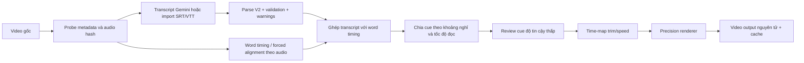

# Kế hoạch phụ đề chính xác mili-giây và tối ưu pipeline

> Trạng thái: Đã triển khai và nghiệm thu kỹ thuật; giữ compatibility adapter trong chu kỳ ổn định  
> Ngày lập: 2026-08-09  
> Ngày nghiệm thu: 2026-08-09  
> Phạm vi: tạo nội dung phụ đề, căn chỉnh thời gian, chỉnh sửa timeline, preview và ghép phụ đề vào video  
> Phạm vi giao diện nghiệm thu: chỉ desktop tại 1024, 1366 và 1440 px; mobile không phải tiêu chí chặn phát hành  
> Mục tiêu ưu tiên: đúng timing, không mất dữ liệu, render ổn định, sau đó mới tối ưu tốc độ và tài nguyên

> Tài liệu này ban đầu là kế hoạch và hiện đồng thời là hồ sơ triển khai. Kết quả đo chi tiết nằm trong `SUBTITLE_ALIGNMENT_BENCHMARK.md` và `SUBTITLE_UI_PERFORMANCE.md`.

## 0. Kết quả triển khai

| Giai đoạn | Trạng thái | Bằng chứng chính |
| --- | --- | --- |
| 0 — Baseline và fixture | Hoàn thành | Baseline parser/render, fixture CFR/VFR/codec và audio tiếng Việt |
| 1 — Timing V2 và parser | Hoàn thành | Integer ms, stable ID, JSON/SRT/VTT/fallback, validator và time-map Decimal |
| 2 — Prompt, editor và UI | Hoàn thành | Prompt JSON V2, editor `HH:MM:SS.mmm`, split/merge, undo/redo, timeline px/giây, desktop 1024–1440 px |
| 3 — Alignment theo audio | Hoàn thành | Energy VAD mặc định, faster-whisper tùy chọn, cache audio hash, confidence/review, manual lock |
| 4 — Renderer và job queue | Hoàn thành | SRT ms, effects ASS 10 ms có nhãn, progress/cancel/cache/atomic, NVENC/QSV/libx264 fallback |
| 5 — Rollout và migration | Hoàn thành phần triển khai | Draft V2 tự migrate/validate; legacy adapter được giữ có chủ đích đến hết chu kỳ ổn định |

Kết quả nghiệm thu cuối:

- Backend Ruff pass, 125 test pass; frontend ESLint, 16 test và production build đều pass.
- Browser E2E giữ nguyên mốc `00:00:00.001` và `00:00:00.999`; split/undo/redo/merge đều pass.
- Timeline 500 cue chỉ mount 101 cue timeline và 4 cue sidebar; kéo đạt 144,5 FPS, không có long task.
- Desktop 1024/1366/1440 px không tràn ngang, stage giữ đúng tỉ lệ và toàn bộ control chính có tên truy cập.
- Renderer pass CFR 23,976–60 FPS, VFR PTS, H.264/HEVC/VP9, MP4/MOV/MKV/WebM và rotation metadata.
- Render thật bằng NVENC đạt 8,424x realtime, stream-copy audio và output bằng khoảng 0,80 lần input.
- Golden alignment đạt combined median 35 ms và P95 70 ms, tốt hơn mục tiêu 80/200 ms.

Hai việc theo dõi sau nghiệm thu không chặn phát hành: thu thập processor-time của cây FFmpeg để khóa KPI giảm CPU 50%, và xóa compatibility adapter chỉ sau một chu kỳ dữ liệu V2 ổn định. Responsive/mobile hiện có được giữ như fallback, nhưng không tiếp tục tối ưu hoặc dùng làm điều kiện nghiệm thu theo phạm vi cuối cùng.

## 1. Quyết định kiến trúc

1. Mốc thời gian chuẩn của hệ thống là số nguyên mili-giây: `start_ms` và `end_ms`.
2. Không dùng `float start_seconds/end_seconds` làm nguồn dữ liệu chính vì phép tính và làm tròn lặp lại có thể gây lệch mốc.
3. Prompt Gemini chỉ tạo transcript và timing nháp. Timing cuối phải được kiểm tra hoặc căn chỉnh theo audio ở cấp từ.
4. Chế độ render chính xác dùng SRT/WebVTT có timestamp mili-giây. ASS hiện tại chỉ được giữ làm chế độ tương thích hiệu ứng vì timestamp văn bản ASS đang có độ phân giải centisecond (10 ms).
5. Mọi thao tác trim và thay đổi tốc độ phải đi qua một hàm biến đổi timeline duy nhất trước khi preview và render.
6. Xuất video chạy dưới dạng job nền, có tiến độ thật, hủy, cache, giới hạn đồng thời và ghi file nguyên tử.
7. Máy hiện tại hỗ trợ NVIDIA NVENC và Intel Quick Sync; pipeline tự kiểm tra khả năng chạy thực tế rồi chọn encoder, không chỉ dựa vào tên GPU.

## 2. Hợp đồng về “chính xác đến mili-giây”

Độ chính xác cần được tách thành ba lớp để không tạo kỳ vọng sai:

| Lớp | Cam kết | Cách kiểm tra |
| --- | --- | --- |
| Dữ liệu | Lưu, sửa, nhập và xuất không mất 1 ms | Round-trip JSON/SRT giữ nguyên `start_ms/end_ms` |
| Render | Bật/tắt phụ đề tại frame đầu tiên phù hợp với timestamp | Kiểm tra frame ngay trước, tại và sau biên cue |
| Nhận dạng tiếng nói | Sai số được đo, không tuyên bố tuyệt đối 1 ms | So với bộ audio gán nhãn thủ công bằng MAE/P95 |

Video 30 FPS chỉ có frame mới mỗi khoảng 33,333 ms; video 60 FPS là khoảng 16,667 ms. Vì vậy dữ liệu có thể chính xác đến 1 ms, nhưng thay đổi nhìn thấy được vẫn bị giới hạn bởi timestamp của frame. Với video VFR, phải dùng PTS thực tế thay vì giả định một FPS cố định.

Mục tiêu thực tế cho căn chỉnh tiếng nói:

- Median absolute error của điểm bắt đầu/kết thúc: không quá 80 ms.
- P95 absolute error: không quá 200 ms.
- Mọi cue có độ tin cậy thấp phải được đánh dấu `needs_review`, không âm thầm coi là chính xác.
- Timing do người dùng chỉnh tay là nguồn có ưu tiên cao nhất và không bị AI tự ghi đè.

## 3. Vấn đề của hệ thống hiện tại

| Vấn đề | Hậu quả | Hướng sửa |
| --- | --- | --- |
| Prompt chỉ yêu cầu `MM:SS` | Mất phần mili-giây ngay từ đầu | Chuyển prompt sang JSON `start_ms/end_ms` và khai báo độ phân giải thực |
| Backend dùng số giây dạng `float` | Có nguy cơ lệch do làm tròn qua nhiều lần chỉnh sửa | Chuyển nguồn dữ liệu sang integer milliseconds |
| `_ass_time()` làm tròn centisecond | Mất tối đa khoảng 5 ms mỗi biên trước khi render | Render chính xác từ SRT/WebVTT; ASS là fallback hiệu ứng |
| Gemini có thể tạo phần lẻ nhìn có vẻ chính xác | False precision, timing không dựa trên audio thật | Thêm `timing_precision_ms`, `timing_source` và bước alignment |
| Trim/tốc độ video chưa có time-map dùng chung | Phụ đề có thể lệch sau trim hoặc đổi speed | Biến đổi cue sang output timeline trước preview/render |
| Render chờ đồng bộ một request | UI treo chờ, không hủy được và dễ bấm lặp | Job nền + progress + cancel + deduplicate |
| Luôn mã hóa lại audio | Tăng CPU và thời gian không cần thiết | `-c:a copy` khi audio không bị chỉnh |
| Fade-out dùng `areverse` hai lần | Có thể dùng nhiều RAM với video dài | Tính trực tiếp `afade=t=out:st=...` |
| `SubtitleStudio.tsx` cập nhật cả editor theo video time | Kéo/tua và phát video dễ lag | Tách component, cô lập clock, dùng ref/rAF |
| Thumbnail seek 8 lần trong trình duyệt và lưu base64 | Tăng decode, RAM và tạo tác vụ khó hủy | Thumbnail sprite được cache hoặc local Blob preview |

Baseline đã đo:

- Parser 500 cue hiện tại: khoảng 3,35 ms trung bình; parser không phải nút thắt tốc độ.
- Một video mẫu 80,78 giây tăng từ khoảng 16,9 MB lên 111,6 MB sau render hiện tại.
- Frontend build, lint và 7 test phụ đề hiện tại đều vượt qua, nhưng test chưa bao phủ workflow render thực tế.

## 4. Mô hình dữ liệu Subtitle V2

```ts
type TimingSource =
  | "manual"
  | "gemini_estimate"
  | "asr_word"
  | "forced_alignment"
  | "imported_srt"
  | "imported_vtt";

type SubtitleWordV2 = {
  id: string;
  text: string;
  start_ms: number;
  end_ms: number;
  confidence: number | null;
};

type SubtitleCueV2 = {
  id: string;
  start_ms: number;
  end_ms: number;
  text: string;
  secondary_text?: string;
  words?: SubtitleWordV2[];
  timing_source: TimingSource;
  timing_precision_ms: number;
  confidence: number | null;
  needs_review: boolean;
  revision: number;
};
```

Quy tắc bất biến:

- `start_ms` là inclusive; `end_ms` là exclusive.
- Cả hai là số nguyên an toàn, `0 <= start_ms < end_ms <= media_duration_ms`.
- Danh sách được sắp theo `start_ms`, sau đó `end_ms`, sau đó `id`.
- Không dùng index mảng làm ID hoặc React key.
- Không tự sửa chồng lấn. Validator trả warning có cue ID để người dùng chọn cách xử lý.
- Mọi phép tính nội bộ dùng integer milliseconds. Chỉ đổi sang giây ở biên giao tiếp với HTMLVideoElement hoặc FFmpeg.
- Sau mỗi chỉnh sửa thủ công: `timing_source="manual"`, tăng `revision`, và khóa cue khỏi auto-alignment cho đến khi người dùng mở khóa.

Định dạng trao đổi JSON:

```json
{
  "schema_version": 2,
  "language": "vi",
  "timebase": "milliseconds",
  "timing_source": "gemini_estimate",
  "timing_precision_ms": 1000,
  "segments": [
    {
      "id": "s0001",
      "start_ms": 75230,
      "end_ms": 78640,
      "text": "Ờ... vẫn chưa.",
      "confidence": 0.72
    }
  ]
}
```

Trong giai đoạn migration, API trả cả trường V2 và trường giây cũ được suy ra. Frontend chỉ ghi V2; trường cũ bị loại bỏ sau khi test và dữ liệu nháp đã chuyển đổi xong.

## 5. Prompt Gemini mới

Prompt mới phải yêu cầu JSON thuần, giữ nguyên lời nói và tuyệt đối không bịa phần mili-giây. Giá trị Gemini trả về vẫn là timing nháp; ứng dụng sẽ căn chỉnh lại theo audio.

```text
Bạn là biên tập viên phụ đề tiếng Việt. Hãy nghe toàn bộ video và tạo transcript theo từng câu nói.

MỤC TIÊU
- Chép đúng lời nói, không tóm tắt, không tự thêm thông tin.
- Giữ các từ đệm có nghe thấy như “ờ”, “ừm”, “à” khi chúng ảnh hưởng ngữ điệu.
- Mỗi đoạn phải có mốc bắt đầu và kết thúc tính từ đầu video.
- Mốc thời gian được biểu diễn bằng số nguyên mili-giây.

QUY TẮC TIMING
1. start_ms là lúc âm đầu tiên của câu bắt đầu; end_ms là lúc âm cuối cùng kết thúc.
2. start_ms < end_ms, không dùng số âm, các đoạn phải theo thứ tự thời gian.
3. Không để hai đoạn chồng lấn. Nếu hai người nói đè nhau, tách speaker nhưng vẫn ghi đúng khoảng nghe thấy.
4. Không bịa ba chữ số mili-giây. Nếu hệ thống chỉ xác định được đến giây, đặt timing_precision_ms = 1000 và dùng phần mili-giây 000.
5. Nếu xác định được gần 100 ms, đặt timing_precision_ms = 100. Chỉ đặt timing_precision_ms = 1 khi thật sự có dữ liệu ở độ phân giải mili-giây.
6. Nếu không nghe rõ một từ, ghi “[không rõ]”; không đoán.

QUY TẮC CHIA CÂU
- Một segment chứa một ý nói tự nhiên, ưu tiên 1–6 giây.
- Không quá 84 ký tự mỗi segment; ưu tiên vị trí dấu câu và khoảng nghỉ để tách.
- Không thêm lời mở đầu, giải thích, Markdown hoặc code fence.

CHỈ TRẢ VỀ MỘT JSON HỢP LỆ THEO MẪU
{
  "schema_version": 2,
  "language": "vi",
  "timebase": "milliseconds",
  "timing_source": "gemini_estimate",
  "timing_precision_ms": 1000,
  "segments": [
    {
      "id": "s0001",
      "start_ms": 0,
      "end_ms": 3000,
      "text": "Nội dung phụ đề.",
      "confidence": 0.90
    }
  ]
}

Trước khi trả kết quả, tự kiểm tra:
- JSON parse được.
- ID không trùng.
- start_ms/end_ms là integer.
- Không có đoạn rỗng, đảo thời gian hoặc chồng lấn.
- Không có văn bản nào ngoài JSON.
```

Fallback cho người dùng dán văn bản không phải JSON vẫn được hỗ trợ:

```text
[00:01:15.230 --> 00:01:18.640] Nội dung phụ đề
```

Parser phải chấp nhận dấu thập phân `.` hoặc `,`, nhưng luôn chuẩn hóa thành integer milliseconds.

## 6. Pipeline tạo và căn chỉnh phụ đề



### 6.1 Probe và cache

- Đọc duration, stream time base, FPS trung bình, loại CFR/VFR, rotation, kích thước, audio sample rate và codec một lần sau upload.
- Lưu metadata theo `video_id` và fingerprint gồm kích thước file, mtime và hash audio.
- Không chạy lại nhận dạng/căn chỉnh khi người dùng chỉ đổi font, màu hoặc vị trí.
- Nếu audio hash không đổi, tái sử dụng word timing.

### 6.2 Tách audio

- Chuyển audio sang mono PCM 16 kHz qua pipe; không ghi WAV lớn xuống ổ đĩa nếu aligner hỗ trợ stdin.
- Video không có audio được nhận diện sớm và chuyển sang chế độ nhập timing thủ công.
- Chia audio dài thành window có overlap nhỏ; xử lý tuần tự để giới hạn VRAM/RAM.
- Job căn chỉnh có cancel, timeout, log gọn và dọn process con trên Windows.

### 6.3 Căn chỉnh cấp từ

- Gemini transcript là nguồn nội dung; word timestamp engine là nguồn timing.
- Ưu tiên forced alignment quanh khoảng coarse của Gemini thay vì nhận dạng lại toàn video mỗi lần.
- So khớp Unicode đã chuẩn hóa, không phân biệt dấu câu; vẫn giữ nguyên text hiển thị của người dùng.
- Lưu confidence từng từ và cue.
- Cue có từ không ghép được, khoảng im lặng bất thường hoặc sai khác transcript lớn phải `needs_review=true`.
- Không tự động thay đổi cue đã được người dùng chỉnh tay.

### 6.4 Chia cue

Mặc định có thể cấu hình:

- 1–6 giây mỗi cue; không ép nếu một câu rất ngắn.
- Tối đa 2 dòng và khoảng 42 ký tự mỗi dòng.
- Tốc độ đọc mục tiêu 12–20 ký tự/giây cho tiếng Việt; vượt ngưỡng phải cảnh báo.
- Tách ưu tiên theo dấu câu, sau đó khoảng nghỉ audio, sau đó giới hạn chiều dài.
- Lead-in hiển thị mặc định 60 ms, tail 100 ms; không vượt midpoint của khoảng nghỉ và không tạo overlap.
- Giữ riêng timing speech gốc và timing display đã thêm lead/tail để có thể đổi chính sách mà không chạy alignment lại.

## 7. Một time-map duy nhất cho trim và tốc độ

Mọi nơi phải dùng cùng công thức:

```text
project_ms = round((source_ms - trim_start_ms) / video_speed)
```

Quy trình:

1. Loại cue nằm hoàn toàn ngoài `[trim_start_ms, trim_end_ms)`.
2. Clamp cue giao biên vào khoảng trim.
3. Trừ `trim_start_ms`.
4. Chia cho `video_speed` bằng phép toán rational hoặc Decimal, chỉ làm tròn một lần ở cuối.
5. Áp cùng time-map cho word timing, waveform, playhead, preview và file subtitle render.
6. Sau biến đổi, chạy validator lần cuối để bắt cue bằng 0 ms, đảo thời gian hoặc overlap do rounding.

Không truyền timing nguồn trực tiếp vào FFmpeg sau khi đã trim hoặc đổi tốc độ.

## 8. Cách ghép phụ đề mới

### 8.1 Precision renderer — mặc định

- Sinh file SRT UTF-8 từ integer milliseconds.
- Dùng filter `subtitles` của FFmpeg; filter này đưa timestamp subtitle vào libass ở đơn vị millisecond.
- Style toàn cục được truyền bằng `force_style`; font dự án truyền bằng `fontsdir` để preview và output dùng cùng font.
- Scale/pad/crop trước, burn subtitle sau để tọa độ style khớp khung output.
- Giữ PTS đầu vào và dùng `-fps_mode passthrough` khi không có yêu cầu đổi FPS.
- Với VFR, nghiệm thu theo frame PTS thực tế.
- Ghi ra `*.part.mp4`; chỉ atomic rename sang file chính khi FFmpeg exit 0 và probe output hợp lệ.

Precision renderer hỗ trợ trước:

- Font, cỡ chữ, màu, bold, italic, underline.
- Outline, shadow, background box.
- Alignment và vị trí chuẩn hóa.
- Hai dòng và secondary text.

### 8.2 Effects renderer — tùy chọn

- Fade/rise/pan/typewriter hiện phụ thuộc ASS override tags.
- Canonical cue vẫn giữ mili-giây; chỉ bản render hiệu ứng được lượng tử hóa tối đa 10 ms nếu tiếp tục dùng ASS text.
- UI phải hiển thị nhãn “Hiệu ứng: độ phân giải timing 10 ms”.
- Không được ghi ngược timing đã lượng tử hóa vào dữ liệu dự án.
- Giai đoạn sau có thể thay activation bằng subtitle packet timestamps hoặc renderer overlay frame-based; chỉ chuyển khi golden tests chứng minh không lệch frame.

### 8.3 Video encoder và audio

Thứ tự tự động:

1. `h264_nvenc` nếu capability test ngắn thành công.
2. `h264_qsv` nếu NVENC không dùng được.
3. `libx264` fallback.

Profile đề xuất:

| Profile | Video | Mục tiêu |
| --- | --- | --- |
| Nhanh | Hardware encoder, giữ resolution/FPS, quality cân bằng | Mặc định trên máy hiện tại |
| Tiết kiệm | 720p, tối đa 30 FPS, hardware encoder | Laptop yếu hoặc video nháp |
| Chất lượng | Resolution/FPS gốc, quality cao hơn | Bản xuất cuối |

Audio:

- Không thay speed/volume/fade: `-c:a copy`.
- Có thay đổi audio: encode AAC một lần.
- Fade-out dùng `afade=t=out:st=<duration-fade>:d=<fade>`, không đảo toàn bộ audio.
- Map audio dạng optional để video không audio vẫn render được.

Các nguyên tắc khác:

- Thêm `-movflags +faststart` cho MP4.
- Không dùng bitrate mặc định khiến file tăng nhiều lần; cấu hình quality/bitrate theo profile.
- Blur background nặng chỉ bật khi người dùng chọn; chế độ tiết kiệm dùng màu/pad đơn giản.
- Queue mặc định một render job để máy vẫn phản hồi.

## 9. API và job model

Endpoint V2 đề xuất:

```text
POST   /api/v1/subtitles/v2/parse
POST   /api/v1/subtitles/v2/align
POST   /api/v1/subtitles/v2/render
GET    /api/v1/subtitles/jobs/{job_id}
DELETE /api/v1/subtitles/jobs/{job_id}
GET    /api/v1/subtitles/jobs/{job_id}/events
```

Job state:

```text
queued -> probing -> extracting_audio -> aligning -> segmenting
       -> validating -> rendering -> verifying -> succeeded
       -> failed | cancelled
```

Yêu cầu:

- `POST render` trả `202` và `job_id`, không giữ request mở trong suốt FFmpeg.
- Đọc progress bằng `-progress pipe:1 -nostats`, không parse log stderr tự do.
- Có `stage`, `percent`, `elapsed_ms`, `eta_ms`, `message` và error code ổn định.
- Cache key gồm video fingerprint, cue V2 đã chuẩn hóa, style, time-map, render profile và phiên bản renderer.
- Hai request cùng cache key dùng chung job, không chạy FFmpeg hai lần.
- Hủy job phải dừng cả cây process và xóa file `.part`.
- Không xóa bản output tốt cũ nếu bản render mới thất bại.

## 10. Thay đổi frontend

### 10.1 Timecode editor

- Hiển thị mặc định `HH:MM:SS.mmm`.
- Input dùng integer milliseconds và có step 1 ms.
- Phím mũi tên: 1 ms; Shift: 10 ms; Ctrl: 100 ms; Alt: một frame.
- Có nút “Snap theo frame” và hiển thị frame PTS gần nhất.
- Có nút “Căn chỉnh lại cue này” thay vì luôn chạy lại toàn video.
- Hiển thị badge `Manual`, `Aligned`, `Gemini estimate`, `Low confidence`.

### 10.2 Timeline và preview

- Clock phát video nằm trong component nhỏ, không làm render lại toàn editor mỗi `timeupdate`.
- Playhead cập nhật qua `requestVideoFrameCallback` nếu trình duyệt hỗ trợ, fallback sang `requestAnimationFrame`.
- Active cue được tra bằng binary search hoặc interval index.
- Drag/trim cập nhật CSS transform bằng ref theo frame; commit state khi pointer up.
- Subtitle list và timeline được virtualize khi có nhiều cue.
- Khoảng không có cue phải hiển thị không phụ đề, không fallback về cue đầu tiên.
- Preview và render cùng dùng time-map, font bundle, target aspect ratio và quy tắc line-wrap.

#### 10.2.1 Bố cục lại toàn bộ vùng làm việc

Giao diện được chia thành bốn vùng có trách nhiệm rõ ràng, không để canvas và timeline tranh chiều cao:

| Vùng | Thiết kế đề xuất | Hành vi |
| --- | --- | --- |
| Preview stage | Nền trung tính bao quanh một stage đen; video luôn giữ đúng aspect ratio, `object-fit: contain`, không kéo méo theo cả chiều rộng và chiều cao | Click video chỉ play/pause; double-click vào phụ đề mới vào chế độ sửa text |
| Transport bar | Một hàng cao khoảng 48–56 px; timecode chính xác `MM:SS.mmm`, lùi/phát/tiến ở giữa, trạng thái Live/Rendered bên phải | Tua không tự phát video; play là thao tác độc lập để tránh cảm giác lag và nhảy ngoài ý muốn |
| Timeline | Rail lớp cố định bên trái, ruler và track cuộn ngang độc lập | Khi phát, viewport chỉ auto-follow lúc playhead gần biên, không giật playhead về giữa mỗi frame |
| Status bar | Số cue, thời lượng, zoom timeline theo `px/giây`, fullscreen | Bỏ các nút trang/help không có chức năng trong Subtitle Studio |

Nguyên tắc thị giác:

- Giữ ngôn ngữ sáng, tối giản và mật độ cao tương tự Canva nhưng không sao chép pixel hay nhồi nhiều control trang trí.
- Canvas là trọng tâm; toolbar định dạng và timeline là công cụ hỗ trợ, không dùng shadow dày hoặc nhiều khung lồng nhau.
- Màu xanh lá chỉ biểu thị cue phụ đề; tím chỉ biểu thị chọn/snap; đường căn tím chỉ xuất hiện trong lúc kéo gần tâm, không hiển thị thường trực.
- Player có border radius và shadow nhẹ; video không bị méo ở mọi tỉ lệ 16:9, 9:16, 1:1 và video có rotation metadata.
- Các nút icon có vùng bấm tối thiểu 40 × 40 px, tooltip, `aria-label`, trạng thái hover/focus/disabled rõ ràng.

#### 10.2.2 Timeline mới: đơn vị pixel trên giây

Timeline hiện tại đặt vị trí và độ rộng cue theo phần trăm toàn video; với video dài, cue ngắn bị ép quá nhỏ rồi chồng lên nhau. Cơ chế mới:

```text
x_px     = project_ms / 1000 * pixels_per_second
width_px = (end_ms - start_ms) / 1000 * pixels_per_second
```

- `pixels_per_second` là nguồn zoom duy nhất, khoảng đề xuất 12–180 px/giây.
- Nội dung timeline rộng theo thời lượng thật và cuộn ngang; rail track không cuộn theo.
- Zoom giữ nguyên điểm thời gian dưới con trỏ hoặc playhead, không nhảy về đầu timeline.
- Ruler chọn bước động: 10 s, 5 s, 2 s, 1 s, 500 ms hoặc theo frame tùy mức zoom.
- Cue có chiều rộng thị giác tối thiểu để vẫn chọn được, nhưng timing dữ liệu tuyệt đối không bị thay đổi theo chiều rộng tối thiểu đó.
- Cue dùng hình chữ nhật bo nhẹ thay vì capsule quá tròn; có trim handle ở hai biên, text ellipsis và tooltip chứa text cùng `start/end` ba chữ số ms.
- Cue đang phát và cue đang chọn là hai trạng thái riêng. Chọn cue không đồng nghĩa phát video.
- Playhead dùng tọa độ pixel và một đường mảnh xuyên các track; click ruler để seek, drag playhead để scrub.
- Khi trim/move, preview chuyển động bằng transform/ref; chỉ commit `start_ms/end_ms` vào project state khi pointer up.
- Snap tùy chọn theo word boundary, cue boundary, playhead hoặc frame PTS; hiển thị loại snap và delta ms ngay cạnh con trỏ.
- Nếu cue overlap, timeline không tự dịch cue khác; hiển thị warning lane hoặc marker để người dùng quyết định.

#### 10.2.3 Preview phụ đề chính xác và không gây lag

- Không fallback về cue đầu tiên khi `current_ms` nằm ngoài tất cả interval.
- Dùng interval `[start_ms, end_ms)` để hai cue liền nhau không cùng active tại một thời điểm biên.
- Đồng bộ theo `requestVideoFrameCallback` và `mediaTime`; không phụ thuộc riêng vào sự kiện `timeupdate` vốn có tần suất thấp.
- Tách `PlaybackClock`, `PreviewStage`, `Transport`, `TimelineViewport`, `SubtitleTrack` và `StatusBar`; thay đổi clock không render lại sidebar, form style hoặc danh sách cue.
- Chỉ subtitle overlay đang active được cập nhật theo frame. Nội dung cue, style và project options giữ trong state ổn định.
- Sửa inline luôn cập nhật cue active bằng stable ID, không dùng selected array index để tránh sửa nhầm sau sort/delete.
- Preview live và video đã render là hai chế độ có nhãn rõ; chuyển chế độ giữ nguyên playhead nếu hai media cùng time-map.

#### 10.2.4 Thumbnail và timeline lớn

- Không seek video và tạo nhiều base64 data URL mỗi lần component render.
- Tạo thumbnail sprite theo `video_id + fingerprint`, lưu cache và chỉ tải lát sprite đang nhìn thấy.
- Với 500 cue trở lên, virtualize theo khoảng thời gian trong viewport cộng overscan thay vì render toàn bộ DOM cue.
- Dùng một spatial/interval index để tìm cue trong viewport và cue active; không `.find()` tuyến tính mỗi frame.
- Pointer move được gộp tối đa một lần mỗi animation frame; không `map()` toàn bộ mảng subtitle trong mỗi pixel kéo.
- Hủy thumbnail/preview task cũ khi đổi video hoặc unmount; giải phóng Object URL đúng lúc.

#### 10.2.5 Responsive và khả năng truy cập

- Desktop: sidebar giữ nguyên, canvas co giãn, timeline cao cố định theo số track và có resize handle nếu cần.
- Màn hình hẹp: sidebar chuyển overlay; timecode phụ rút gọn trước, không thu nhỏ nút play xuống dưới vùng bấm an toàn.
- Timeline hỗ trợ bàn phím: Space play/pause; Left/Right 1 ms; Shift 10 ms; Ctrl 100 ms; Alt một frame; Home/End về biên project.
- Focus ring nhìn rõ trên stage sáng/tối; không chỉ dùng màu để phân biệt selected, active, warning và low-confidence.
- Tôn trọng `prefers-reduced-motion`; không animate layout trong lúc zoom, trim hoặc đổi track.

#### 10.2.6 Thứ tự triển khai giao diện để tránh sửa chồng

1. Chốt model V2, time-map và selector active cue trước.
2. Tách playback clock khỏi `SubtitleStudio.tsx` nhưng chưa đổi hình thức.
3. Thay timeline phần trăm bằng engine `px/giây` và horizontal viewport.
4. Thêm drag/trim commit-on-release, snap và keyboard fine-tuning.
5. Thay thumbnail data URL bằng sprite/cache và thêm virtualization.
6. Sau khi hành vi pass test mới áp visual layer cho stage, transport, track, status và responsive.
7. Chạy visual regression ở 1440×900, 1366×768, 1024×768 và 390×844 trước khi nghiệm thu.

### 10.3 Khả năng phục hồi

- Undo/redo cho text, timing, split, merge và delete.
- Autosave debounce dự án V2; không autosave mỗi pixel khi drag.
- AbortController cho upload, parse, align và render request.
- Khi reload, UI gắn lại job đang chạy thay vì khởi động job mới.

## 11. Tối ưu CPU, GPU, RAM và ổ đĩa

| Hạng mục | Biện pháp |
| --- | --- |
| Parser | Giữ backend parser đơn giản; baseline đã dưới 4 ms/500 cue |
| React | Component hóa, memo, virtualize, tách playback clock khỏi project state |
| Drag | rAF + pointer capture + commit một lần |
| Thumbnail | Sprite/cache; không giữ nhiều data URL base64 |
| Alignment | Chạy theo audio hash, theo cue/window, cache word timing, concurrency 1 |
| GPU model | FP16 khi hỗ trợ, unload sau thời gian idle, không giữ model khi chỉ chỉnh style |
| Render | NVENC/QSV, audio copy có điều kiện, profile tiết kiệm |
| Disk | Atomic output, quota, retention, dọn temp cũ và cache LRU |
| Network | Local Blob preview trong lúc upload; không tải lại video vừa chọn |

Ngân sách hiệu năng mục tiêu:

- Parse 500 cue: P95 dưới 20 ms.
- Editor 500 cue: ít nhất 55 FPS khi kéo/tua trên máy hiện tại.
- Không có main-thread task trên 100 ms trong thao tác kéo bình thường.
- Render profile Nhanh: tối thiểu 2x realtime với video 1080p thông thường trên RTX 4050, đo lại theo codec/FPS thực tế.
- CPU trung bình khi hardware encode giảm ít nhất 50% so với pipeline libx264 hiện tại.
- Output profile Nhanh không lớn hơn 2,5 lần input trừ khi input dùng codec hiệu quả hơn nhiều hoặc người dùng chọn Quality.
- Cache hit cùng input/config trả kết quả dưới 1 giây.
- Sau cancel/fail không còn FFmpeg process, `.part` hoặc subtitle temp file.

## 12. Kiểm thử bắt buộc

### 12.1 Unit tests

- Parse/format `00:00:00.001`, `00:00:00,001`, giờ lớn hơn 0 và biên 999 ms.
- Round-trip JSON -> model -> SRT -> model giữ nguyên từng mili-giây.
- Không chấp nhận float, NaN, infinity, end <= start hoặc vượt duration.
- Sort ổn định, ID không trùng, warning overlap/gap.
- Time-map cho trim, speed 0.5/1/1.25/1.5/2 và tổ hợp trim + speed.
- Cue giao biên trim, cue ngắn sau rounding, word timing bị clamp.
- Escape Unicode, dấu ngoặc, backslash, newline và chữ tiếng Việt.
- Cache key thay đổi đúng khi cue/style/profile/renderer version đổi.

### 12.2 Integration tests FFmpeg

Ma trận video:

- CFR: 23.976, 24, 25, 29.97, 30, 50, 59.94 và 60 FPS.
- VFR có khoảng frame không đều.
- H.264, HEVC, VP9/WebM và MKV.
- Có audio, không audio, mono, stereo và sample rate 44.1/48 kHz.
- 16:9, 9:16, 1:1, rotation metadata.
- NVENC, QSV và libx264 fallback.

Với mỗi cue, lấy frame ngay trước và ngay sau biên để xác nhận:

- Không xuất hiện sớm hơn frame PTS hợp lệ.
- Không tồn tại sau `end_ms` ngoài giới hạn một frame.
- Trim/speed không làm lệch text so với audio.
- Preview và rendered frame có cùng vị trí, line-wrap và font.

### 12.3 Golden alignment dataset

- Tạo bộ clip ngắn tiếng Việt có nhãn onset/offset thủ công.
- Bao gồm nói nhanh, nói nhỏ, từ đệm, khoảng im lặng, nhạc nền, hai người nói và tiếng ồn.
- Báo cáo MAE, median, P95 riêng cho start và end.
- Không merge thay đổi model/heuristic nếu P95 xấu hơn baseline mà không có quyết định rõ ràng.

### 12.4 End-to-end

1. Upload video.
2. Copy prompt và paste JSON.
3. Parse, xem warning, chạy alignment.
4. Chỉnh một cue đến 1 ms, split/merge, undo/redo.
5. Trim và đổi speed.
6. Render, xem progress, cancel thử, render lại.
7. Reload trang và gắn lại job.
8. Tải output và kiểm tra frame boundary.

## 13. Lộ trình triển khai

### Giai đoạn 0 — Baseline và fixture — Hoàn thành

- Lưu các video fixture nhỏ và kết quả render chuẩn.
- Ghi benchmark CPU/RAM/GPU, thời gian, kích thước output và UI FPS.
- Chốt error taxonomy và migration flag.

Hoàn thành khi có số đo tái lập được trước khi sửa.

### Giai đoạn 1 — Timing V2 và parser — Hoàn thành

- Thêm model integer milliseconds và stable ID.
- Viết parser JSON/SRT/VTT/fallback mới.
- Viết validator/warning và hàm time-map.
- Duy trì adapter response cũ trong thời gian migration.

Hoàn thành khi unit test round-trip 1 ms và time-map đều pass.

### Giai đoạn 2 — Prompt và editor V2 — Hoàn thành

- Thay prompt mẫu.
- Timecode editor 3 chữ số ms, frame snap, badge nguồn timing.
- Sửa active cue, selected cue và thao tác bằng stable ID.
- Tách component, rAF drag, virtualize.

Hoàn thành khi 500 cue chỉnh mượt và không sửa nhầm cue.

### Giai đoạn 3 — Alignment theo audio — Hoàn thành

- Probe/cache audio fingerprint.
- Tích hợp word timing/forced alignment dạng job.
- Ghép transcript, confidence, review workflow và cache.
- Tối ưu chunk/concurrency/unload model.

Hoàn thành khi golden dataset đạt ngưỡng đã chốt.

### Giai đoạn 4 — Precision renderer và job queue — Hoàn thành

- SRT ms renderer, shared time-map, font bundle.
- Job progress/cancel/cache/atomic output.
- NVENC/QSV/libx264 capability fallback.
- Audio copy, direct fade-out, bitrate profile và cleanup.

Hoàn thành khi integration matrix và benchmark pass.

### Giai đoạn 5 — Effects, rollout và dọn legacy — Đã triển khai, đang giữ adapter ổn định

- Gắn nhãn precision cho ASS effects hoặc thay renderer nếu golden test đạt.
- Migrate autosave/project data cũ.
- Chạy E2E, soak test video dài và test cancel/restart.
- Sau một chu kỳ ổn định mới xóa field giây và code legacy.

Ước lượng ban đầu là 8,5–16 ngày. Bản hiện tại đã hoàn tất chức năng; việc xóa adapter cũ được hoãn đúng chủ đích đến sau chu kỳ ổn định.

## 14. File dự kiến thay đổi

| File/khu vực | Thay đổi |
| --- | --- |
| `frontend/src/SubtitleStudio.tsx` | Tạm thời nối V2; sau đó tách thành các component nhỏ |
| `frontend/src/subtitles/` | Model, reducer, time-map, parser adapter, timeline và editor mới |
| `frontend/src/api.ts` | Kiểu V2, align/render job, progress và cancel |
| `backend/app/schemas.py` | `SubtitleCueV2`, word timing, job/result/warning schema |
| `backend/app/services/subtitles.py` | Tách parse, validate, transform và render; bỏ float làm nguồn chính |
| `backend/app/services/subtitle_alignment.py` | Audio extraction, alignment, confidence và cache |
| `backend/app/services/subtitle_jobs.py` | Queue, process lifecycle, progress, cancel và atomic output |
| `backend/app/main.py` | Endpoint V2 và compatibility adapter |
| `backend/app/config.py` | Encoder/profile/concurrency/cache/retention settings |
| `backend/tests/test_subtitles.py` | Unit test timing V2 |
| `backend/tests/test_subtitle_render.py` | Integration FFmpeg và frame-boundary tests |
| `frontend/e2e/` | Workflow editor/align/render/cancel/reload |

## 15. Rủi ro và biện pháp

| Rủi ro | Biện pháp |
| --- | --- |
| Gemini trả `.123` nhưng chỉ ước lượng theo giây | Bắt buộc `timing_precision_ms`; alignment quyết định timing cuối |
| Người dùng hiểu “1 ms” là AI nghe chính xác tuyệt đối | UI tách data precision, frame precision và alignment confidence |
| ASS làm mất phần ms | Precision mode dùng SRT; ASS không được ghi ngược canonical timing |
| VFR làm snap theo FPS trung bình bị sai | Dùng frame PTS thực và `fps_mode passthrough` |
| Alignment làm nặng GPU/RAM | On-demand, cache audio hash, chunk tuần tự, concurrency 1, unload idle |
| Hardware encoder có tên nhưng runtime lỗi | Chạy capability encode ngắn; fallback tự động và ghi lý do |
| Render mới ghi đè output tốt rồi thất bại | File `.part`, verify, atomic rename, output versioned |
| Font preview khác output | Bundle font và truyền `fontsdir` |
| Migration phá project nháp cũ | Adapter hai chiều, backup, feature flag và rollback |

## 16. Tiêu chí nghiệm thu cuối

- [x] Prompt trả JSON V2 hợp lệ và không khuyến khích bịa mili-giây.
- [x] Canonical timing chỉ dùng integer milliseconds.
- [x] JSON/SRT round-trip không mất 1 ms.
- [x] Preview và render dùng cùng time-map sau trim/speed.
- [x] Khoảng không có cue không hiển thị phụ đề.
- [x] Video preview giữ đúng aspect ratio, không kéo méo theo kích thước vùng canvas.
- [x] Timeline dùng `px/giây`, zoom và cuộn ngang được; cue ngắn không còn chồng nhau do min-width phần trăm.
- [x] Tua timeline không tự phát video; cue active và cue selected hoạt động độc lập.
- [x] Đường snap chỉ xuất hiện trong lúc kéo và có nhãn delta mili-giây.
- [x] Timeline 500 cue không render toàn bộ ngoài viewport và vẫn đạt ngân sách FPS.
- [x] Keyboard fine-tuning, focus ring và `prefers-reduced-motion` đều được kiểm thử.
- [x] Cue chỉnh tay không bị alignment tự ghi đè.
- [x] Precision renderer đạt frame-boundary tests trên CFR và VFR.
- [x] Job có progress thật, cancel và gắn lại sau reload.
- [x] NVENC/QSV hoạt động và fallback libx264 được test.
- [x] Audio không đổi được stream-copy.
- [x] Không còn `areverse` cho fade-out.
- [x] Không còn process hoặc temp file sau fail/cancel.
- [x] Editor 500 cue đạt ngân sách FPS.
- [x] Golden alignment dataset đạt median/P95 đã chốt.
- [x] Output size đạt ngân sách; ngoại lệ telemetry CPU được ghi rõ trong báo cáo hiệu năng.
- [x] Toàn bộ build, lint, unit, integration và E2E pass.

## 17. Tài liệu tham chiếu chính thức

- [Gemini API — Video understanding](https://ai.google.dev/gemini-api/docs/video-understanding): tài liệu hiện mô tả timestamp `MM:SS`, video frame được lấy mẫu 1 FPS và timestamp được thêm mỗi giây; vì vậy prompt Gemini đơn lẻ không phải nguồn đáng tin cậy cho timing 1 ms.
- [FFmpeg documentation — progress](https://ffmpeg.org/ffmpeg.html): dùng `-progress pipe:1` để nhận dữ liệu tiến độ dạng máy đọc được.
- [FFmpeg documentation — frame rate and fps mode](https://ffmpeg.org/ffmpeg.html): phân biệt CFR, VFR và `fps_mode passthrough` khi bảo toàn timestamp frame.
- [FFmpeg subtitle filter source](https://ffmpeg.org/doxygen/8.0/vf__subtitles_8c_source.html): subtitle packet timestamp được scale sang đơn vị millisecond trước khi chuyển vào libass.
- [OpenAI Whisper transcribe implementation](https://github.com/openai/whisper/blob/main/whisper/transcribe.py): một phương án local có word timestamps; phải benchmark trên tiếng Việt và không coi timing mô hình là ground truth tuyệt đối.
